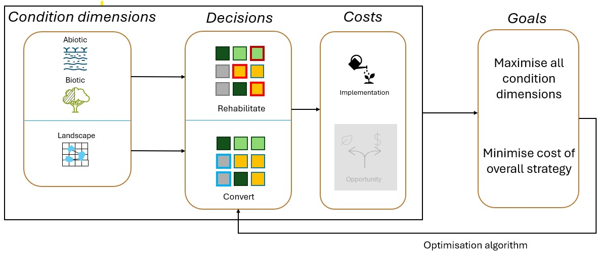

Code available at https://github.com/isabelntho/rest_prio

Can click on figures to make them larger

# Conceptual overview of workflow

{fig-cap="Workflow overview"}

```{r}
#| label: setup
#| include: false

# Load required libraries
library(jsonlite)
library(ggplot2)
library(dplyr)
library(tidyr)
library(patchwork)
library(DT)
library(plotly)
library(viridis)
library(corrplot)
library(scales)
library(stringr)
library(reticulate)
library(gridExtra)
library(grid)
library(magick)
library(cowplot)
# Configure Python environment for reticulate
use_condaenv("rest_pymoo", required = TRUE)

# Set ggplot theme
theme_set(theme_minimal() + 
          theme(plot.title = element_text(size = 14, face = "bold"),
                plot.subtitle = element_text(size = 12, color = "gray40")))

theme_sp <- theme_minimal() +
    theme(legend.position = "bottom",
    axis.text=element_blank(),
    axis.title=element_blank())
```

```{r}
#| label: load-data

# Define ecosystem types
ecosystem_types <- c("forest", "agricultural", "grassland")

ecosystem_reports <- list()

file_names <- list(
  'forest' = "optimization_report_forest_20260209_154808.json",
  'agricultural' = "optimization_report_agricultural_20260209_160745.json",
  'grassland' = "optimization_report_grassland_20260209_162713.json"
)

for (ecosystem in names(file_names)) {
  latest_file <- file_names[[ecosystem]]
        # Read the raw JSON text first
  json_text <- readLines(latest_file, warn = FALSE)
  json_text <- paste(json_text, collapse = "\n")
        
        # Replace NaN with null (valid JSON)
  json_text <- gsub('\\bNaN\\b', 'null', json_text)
        
        # Parse the cleaned JSON
  ecosystem_reports[[ecosystem]] <- fromJSON(json_text, flatten = FALSE)
  ecosystem_reports[[ecosystem]]$source_file <- latest_file
}


ecosystem_evolution_reports<- list()

file_names <- list(
  'forest' = "evolution_reports/evolution_report_forest_20260209_154808.json",
  'agricultural' = "evolution_reports/evolution_report_agricultural_20260209_160745.json",
  'grassland' = "evolution_reports/evolution_report_grassland_20260209_162713.json"
)

for (ecosystem in names(file_names)){
  latest_file <- file_names[[ecosystem]]
  # Read the raw JSON text first
  json_text <- readLines(latest_file, warn = FALSE)
  json_text <- paste(json_text, collapse = "\n")
  
  # Replace NaN with null (valid JSON)
  json_text <- gsub('\\bNaN\\b', 'null', json_text)
  
  # Parse the cleaned JSON
  ecosystem_evolution_reports[[ecosystem]] <- fromJSON(json_text, flatten = FALSE)
}

#ecosystem_evolution_reports <- find_ecosystem_evolution_reports(ecosystem_types)

if (length(ecosystem_reports) == 0) {
  stop("No ecosystem optimization reports found. Please run optimizations first.")
}

# Setup Python visualization functions
py_run_string("
import sys
import os
import numpy as np
import pickle
import warnings

# Import pymoo classes to handle pickle loading
try:
    from pymoo.indicators.hv import HV
    from pymoo.util.callback import Callback
    # Define HVCallback class if it's not available
    class HVCallback(Callback):
        def __init__(self, ref_point):
            super().__init__()
            self.ref_point = ref_point
            self.hv = HV(ref_point=ref_point)
            self.history = []
        def notify(self, algorithm):
            hv_value = self.hv.do(algorithm.pop.get('F'))
            self.history.append(hv_value)
except ImportError:
    #print('Warning: pymoo not fully available, some features may not work')
    # Define a dummy HVCallback class
    class HVCallback:
        def __init__(self, ref_point):
            self.ref_point = ref_point
            self.history = []

# Custom pickle loader that handles missing classes gracefully
class SafeUnpickler(pickle.Unpickler):
    def find_class(self, module, name):
        # Handle missing HVCallback class
        if name == 'HVCallback':
            return HVCallback
        # For other missing classes, return a dummy class
        try:
            return super().find_class(module, name)
        except (ImportError, AttributeError) as e:
            warnings.warn(f'Could not import {module}.{name}, using dummy class: {e}')
            # Return a dummy class
            class DummyClass:
                def __init__(self, *args, **kwargs):
                    pass
            return DummyClass

def safe_pickle_load(file_path):
    '''Load pickle file with graceful handling of missing classes'''
    with open(file_path, 'rb') as f:
        return SafeUnpickler(f).load()

# Monkey patch the pickle loading in visualisations
import visualisations
original_load_results = visualisations.load_results

def patched_load_results(pkl_path, scenario_id=None):
    '''Patched version of load_results that uses safe pickle loading'''
    with open(pkl_path, 'rb') as f:
        raw_results = SafeUnpickler(f).load()

    # Continue with the original processing logic
    if 'scenarios' in raw_results:
        # Multi-scenario file
        if scenario_id == 'all':
            all_results = []
            for sid in sorted(raw_results['scenarios'].keys()):
                scenario_results = raw_results['scenarios'][sid].copy()
                scenario_results['multi_scenario_info'] = {
                    'total_scenarios': raw_results['n_scenarios_total'],
                    'scenarios_run': raw_results['n_scenarios_run'],
                    'current_scenario_id': sid,
                    'all_scenario_ids': list(raw_results['scenarios'].keys())
                }
                all_results.append(scenario_results)
            return all_results
        else:
            if scenario_id is None:
                scenario_id = 0
            if scenario_id not in raw_results['scenarios']:
                available = list(raw_results['scenarios'].keys())
                raise ValueError(f'Scenario {scenario_id} not found. Available scenarios: {available}')
            results = raw_results['scenarios'][scenario_id].copy()
            results['multi_scenario_info'] = {
                'total_scenarios': raw_results['n_scenarios_total'],
                'scenarios_run': raw_results['n_scenarios_run'],
                'current_scenario_id': scenario_id,
                'all_scenario_ids': list(raw_results['scenarios'].keys())
            }
            return results
    else:
        # Single scenario file
        return raw_results

# Apply the patch
visualisations.load_results = patched_load_results

from visualisations import (
    plot_eligible_pixels, plot_objectives_correlation_matrix,
    create_selection_frequency_map, plot_example_solution,
    plot_pareto_front, plot_parallel_coordinates
)
from data_loader import load_initial_conditions
")

# Find ecosystem-specific results files
#ecosystem_results_files <- list()
#for (ecosystem in ecosystem_types) {
#   Look for results files matching this ecosystem
#  pattern <- paste0("results_", ecosystem, ".*\\.pkl$")
#  files <- list.files(".", pattern = pattern, full.names = TRUE)
#  
#  if (length(files) > 0) {
#    # Get the most recent file for this ecosystem
#    latest_file <- files[which.max(file.info(files)$mtime)]
#    ecosystem_results_files[[ecosystem]] <- latest_file
#    cat("Using", ecosystem, "results file:", latest_file, "\n")
#  } else {
#    cat("✗ No", ecosystem, "results file found\n")
#    ecosystem_results_files[[ecosystem]] <- NULL
#  }
#}
# Manually override results files per ecosystem (edit these paths)
ecosystem_results_files = list(
  # Example:
   'forest'= 'results_forest_0902_7.pkl',
   'agricultural'= 'results_agricultural_0902_7.pkl',
   'grassland'= 'results_grassland_0902_7.pkl'
)

# Also find the most recent general results file as fallback
results_files <- list.files(".", pattern = "results_.*\\.pkl$", full.names = TRUE)
if (length(results_files) > 0) {
  latest_results_file <- results_files[which.max(file.mtime(results_files))]
  #cat("General latest results file:", latest_results_file, "\n")
} else {
  latest_results_file <- NULL
  cat("No general results .pkl files found\n")
}

# Function to load multiple scenario summaries
load_scenario_summaries <- function(pattern = "summary_.*\\.json$") {
  files <- list.files(".", pattern = pattern, full.names = TRUE)
  if (length(files) == 0) return(NULL)
  
  scenario_summaries <- list()
  for (file in files) {
    tryCatch({
      scenario_name <- gsub("pareto_summary_|\\.json", "", basename(file))
      scenario_summaries[[scenario_name]] <- fromJSON(file, flatten = FALSE)
      scenario_summaries[[scenario_name]]$scenario_id <- scenario_name
    }, error = function(e) {
      cat("Warning: Could not load", file, "-", e$message, "\n")
    })
  }
  return(scenario_summaries)
}
```

## Initial Conditions

### Spatial distribution

```{r}
#| label: initial-conditions-spatial
#| fig.width: 12
#| fig.height: 8

# Load required libraries for raster operations
library(terra)
library(raster)

# Function to load and process raster data
load_raster_data <- function() {
  raster_files <- list(
    abiotic_anomaly = "abiotic_condition_anomaly.tif",
    biotic_anomaly = "biotic_condition_anomaly.tif", 
    landscape_anomaly = "landscape_condition_anomaly.tif",
    implementation_cost = "implementation_cost.tif"
  )
  
  # Check which files exist
  existing_files <- sapply(raster_files, file.exists)
  
  if (!any(existing_files)) {
    cat("No raster files found for initial conditions visualization.\n")
    return(NULL)
  }
  
  raster_data <- list()
  
  for (obj_name in names(raster_files)) {
    if (existing_files[obj_name]) {
      tryCatch({
        raster_data[[obj_name]] <- rast(raster_files[[obj_name]])
      }, error = function(e) {
        cat("✗ Error loading", obj_name, ":", e$message, "\n")
      })
    } else {
      cat("✗ File not found:", raster_files[[obj_name]], "\n")
    }
  }
  
  return(raster_data)
}

# Load raster data
raster_data <- load_raster_data()

# Load LULC data
lulc_raster <- rast("W:/EU_BioES_SELINA/WP3/4. Spatially_Explicit_EC/Data/LULC/LULC_2018_agg.tif")

lulc_data <- crop(lulc_raster, raster_data[[1]])

raster_data <- c(raster_data[[1]], raster_data[[2]], raster_data[[3]], raster_data[[4]], lulc_data)
raster_data <- stack(raster_data)

df <- as.data.frame(raster_data, xy = TRUE)
names(df)[3:6]<- c("Abiotic_Anomaly", "Biotic_Anomaly", "Landscape_Anomaly", "Implementation_Cost")
df <- df %>%
  drop_na()%>%
  filter(layer %in% c(12,13,15,16,17))%>%
  pivot_longer(cols = c("Abiotic_Anomaly", "Biotic_Anomaly", "Landscape_Anomaly", "Implementation_Cost"),
               names_to = "Objective",
               values_to = "Value")%>%
  mutate(
    ecosystem_type = case_when(
      layer %in% c(12, 13) ~ "forest",
      layer %in% c(15) ~ "agricultural",
      layer %in% c(16, 17) ~ "grassland"
    )
  )
# Convert rasters to data frames for ggplot

df <- df[!is.na(df$Value), ]

asp <- ggplot(df%>%filter(Objective=="Abiotic_Anomaly"), aes(x = x, y = y, fill = Value)) +
    geom_raster() +
    scale_fill_viridis_c(name = "Value") +
    labs(title = "Abiotic anomaly")+
    theme_sp +
    coord_equal()

bsp <- ggplot(df%>%filter(Objective=="Biotic_Anomaly"), aes(x = x, y = y, fill = Value)) +
    geom_raster() +
    scale_fill_viridis_c(name = "Value") +
    labs(title = "Biotic anomaly")+
    theme_sp +
    coord_equal()

lsp <- ggplot(df%>%filter(Objective=="Landscape_Anomaly"), aes(x = x, y = y, fill = Value)) +
    geom_raster() +
    scale_fill_viridis_c(name = "Value") +
    labs(title = "Landscape anomaly")+
    theme_sp +
    coord_equal()

csp <- ggplot(df%>%filter(Objective=="Implementation_Cost"), aes(x = x, y = y, fill = Value)) +
    geom_raster() +
    scale_fill_viridis_c(name = "Value") +
    labs(title = "Implementation cost")+
    theme_sp +
    coord_equal()

# Combine plots
combined_spatial_plot <- (asp | bsp) / (lsp | csp)
print(combined_spatial_plot)
```

### Distribution of values

```{r}
#| label: initial-conditions-histograms
#| fig.width: 12
#| fig.height: 10

# Extract baseline values from optimization reports
baseline_data <- do.call(rbind, lapply(names(ecosystem_reports), function(ecosystem) {
  report <- ecosystem_reports[[ecosystem]]
  objectives <- report$problem_definition$objectives
  
  if (!is.null(objectives$baseline_values) && length(objectives$baseline_values) > 0) {
    baseline_df <- data.frame(
      Ecosystem = ecosystem,
      Objective = names(objectives$baseline_values),
      Baseline_Value = unlist(objectives$baseline_values),
      stringsAsFactors = FALSE
    )
    return(baseline_df)
  }
  return(NULL)
}))

p_histograms_eco <- ggplot(df, aes(x = Value, fill = ecosystem_type)) +
        geom_histogram(bins = 30, alpha = 0.7, position = "identity") +
        scale_fill_viridis_d(name = "Ecosystem") +
        labs(title = "Distribution of Initial Condition Values",
             x = "Value", y = "Frequency") +
        facet_wrap(~ecosystem_type + Objective, scales = "free") +
        theme_minimal() +
        theme(axis.text.x = element_text(angle = 45, hjust = 1),
              strip.text = element_text(size = 8),
              legend.position = "bottom")
      
print(p_histograms_eco)
    
p_boxplots_eco <- ggplot(df, aes(x = ecosystem_type, y = Value, fill = ecosystem_type)) +
        geom_boxplot(alpha = 0.7, outlier.size = 0.5) +
        scale_fill_viridis_d(name = "Ecosystem") +
        labs(title = "Boxplots of Initial Condition Values by Ecosystem Type",
             x = "Ecosystem Type", y = "Value") +
        facet_wrap(~ Objective, scales = "free_y") +
        theme_minimal() +
        theme(axis.text.x = element_text(angle = 45, hjust = 1),
              strip.text = element_text(size = 10),
              legend.position = "none")
```

# Objectives & decisions

Decision to restore:

$$
x_i^{R} \in \{0,1\}
$$

Decision to convert:

$$
x_j^{C} \in \{0,1\}
$$

Within a set budget of actions

$$
\sum_i x_i^{R} + \sum_j x_j^{C} = N_{\text{budget}}
$$

## Overview of objective functions

**Abiotic & biotic condition**

Positive or neutral anomalies receive no improvement. For restored pixels starting with a negative anomaly: $$
a_i^{1} = a_i^{0} + \alpha_A \, w(a_i^{0})
$$

-   $a_i^{1}$ is the anomaly after restoration, $a_i^{0}$ is the baseline anomaly
-   $\alpha_A$ = abiotic effect, i.e. a constant that represents an arbitrary improvement achieved through restoration
-   $w(a)$ is a weighting function based on the magnitude of the anomaly.

The improvement is scaled by a weight that depends on the baseline anomaly. This assigns larger improvement weights to pixels with larger negative anomalies. If the anomaly is close to zero, the weight is small. As the anomaly becomes more negative, the weight increases and approaches 1.

$$
w(a) = \left(1 - e^{-\frac{|a|}{s}}\right)^{\gamma}
$$

-   s and $gamma$ are shape parameters that control how quickly the weight increases with the magnitude of the anomaly. Probably both aren't needed.

```{r}
#Overview of the weighting function effect

library(ggplot2)
library(gridExtra)

# Weight function
w_fun <- function(a, s = 1, gamma = 3){
  (1 - exp(-abs(a) / s))^gamma
}

# Data
a_vals <- seq(-3, 0, length.out = 200)

# --- Plot effect of s ---
df_s <- expand.grid(
  a = a_vals,
  s = c(0.5, 1, 2),
  gamma = 3
)

df_s$w <- with(df_s, w_fun(a, s, gamma))

p_s <- ggplot(df_s, aes(a, w, colour = factor(s))) +
  geom_line(linewidth = 1) +
  labs(title = "Effect of s",
       x = "|Anomaly|",
       y = "Weight",
       colour = "s") +
  theme_minimal()

# --- Plot effect of gamma ---
df_g <- expand.grid(
  a = a_vals,
  s = 1,
  gamma = c(1, 2, 4, 6)
)

df_g$w <- with(df_g, w_fun(a, s, gamma))

p_g <- ggplot(df_g, aes(a, w, colour = factor(gamma))) +
  geom_line(linewidth = 1) +
  labs(title = "Effect of gamma",
       x = "Anomaly",
       y = "Weight",
       colour = "gamma") +
  theme_minimal()

# --- Side by side ---
grid.arrange(p_s, p_g, ncol = 2)
```

For pixels neighbouring restored pixels: $$
a_k^{1} = a_k^{0} + \alpha_A \, \lambda \, w(a_k^{0})
$$

-   $\lambda$ is the effect decay with distance from the restored pixel.

Optimisation minimises the negative total improvement over the study area (i.e., Maximises total abiotic/biotic improvement from restoration):

$$
f_{\text{a/biotic}}(x)=-\sum_{i \in \Omega_R}\left(a_i^{1} - a_i^{0}\right)
$$

Other choices for the objective function could be to maximise the improvement in the worst-off pixels (i.e., minimising the worst anomaly after restoration), or maximising the number of pixels for which condition passes a certain threshold.

**Landscape condition**

$x_j^{C}$ = 1 changes LULC of selected pixels to a desired class. Landscape anomaly is recalculated based on new LULC raster.

$$
L^{1} = 1 - D(\mathrm{LULC}^{1})
$$

where $$
\mathrm{LULC}^{1} =\begin{cases}\text{focal class}, & \text{if } x_j^{C} = 1 \\\mathrm{LULC}^{0}, & \text{otherwise}\end{cases}
$$

Optimisation minimises the total landscape anomaly across the whole study area:

$$
f_{\text{landscape}}(x) =\sum_{p \in \Omega}L_p^{1}
$$

Optimisation minimizes the total landscape anomaly as the simple sum of the landscape anomaly raster values after applying the conversion driven landscape update.

**Implementation cost**

$$
f_{\text{cost}}(x) =\sum_{k \in \Omega_{R}} y^{R}_{k}(x)\,c_{k}+\sum_{k \in \Omega_{C}} y^{C}_{k}(x)\,c_{k}
$$

The code computes total implementation cost as the sum of baseline cost over all pixels selected for restoration plus all pixels selected for conversion, then minimizes that total.

**Baseline values**

```{r}
#| label: baseline-data-viz
baseline_data$Baseline_Abs <- abs(baseline_data$Baseline_Value)
baseline_data$Sign <- ifelse(baseline_data$Baseline_Value < 0, "negative", "positive")

p_baseline <- ggplot(baseline_data, aes(x = Objective, y = Baseline_Abs, fill = Ecosystem)) +
  geom_col(position = "dodge", alpha = 0.8) +
  scale_fill_viridis_d() +
  labs(title = "Baseline Objective Magnitudes by Ecosystem",
       x = "Objective", y = "Absolute baseline value") +
  facet_wrap(~Objective, scales = "free") +
  theme(axis.text.x = element_blank())
  
  print(p_baseline)
```

Calculation of the landscape anomaly same for each ecosystem type, because the calculation is the same...logically this might need some work. Implementation cost objective is 0 for all ecosystems, as cost only incurred after restoration decisions are applied.

## Eligible pixels for restoration and conversion

```{python}
#| label: eligible-pixels-viz
#| fig.width: 12
#| fig.height: 8
#| echo: false

try:
    # Load initial conditions to show eligible pixels
    initial_conditions = load_initial_conditions(".", objectives=['abiotic', 'biotic', 'landscape', 'cost'])
    
    # Create eligible pixels visualization
    plot_eligible_pixels(
        initial_conditions,
        save_path='figs/eligible_pixels.png',
        title="Eligible Pixels for Restoration and Conversion Actions"
    )
    print("✓ Eligible pixels visualization completed")
    
except Exception as e:
    print(f"Could not create eligible pixels plot: {e}")
```

Pixels eligible for restoration: any pixels within the ecosystem type (Forest: Open & Closed Forest; Agricultural: Intensive Agriculture; Grassland: Grassland & Alpine Pastures)

## Constraints and repair

*Constraint formulation*

The optimisation is formulated with a fixed restoration budget.

The total number of selected pixels, including restoration and conversion actions, is constrained to equal a predefined maximum derived from the scenario specific restoration fraction.

*Repair strategy*

A unified adaptive repair operator is applied after crossover and mutation.

-   Solutions that deviate strongly from the target number of actions (\>20% of target number) are adjusted to restore feasibility.
-   Small deviations are tolerated to preserve diversity.
-   When repair is required, pixels are added or removed using a neutral, random mechanism.

# Output from optimisation runs

## Overview by Ecosystem

```{r}
#| label: ecosystem-overview

# Create comparison table for all ecosystems
ecosystem_summary <- do.call(rbind, lapply(names(ecosystem_reports), function(ecosystem) {
  report <- ecosystem_reports[[ecosystem]]
  
  # Extract key metrics
  objectives <- report$problem_definition$objectives
  dec_vars <- report$problem_definition$decision_variables
  algo <- report$algorithm_configuration
  results <- report$results_summary
  
  data.frame(
    Ecosystem = ecosystem,
    Objectives = objectives$count,
    Total_Pixels = dec_vars$total_pixels,
    Max_Restored_Pixels = dec_vars$bounds$max_restored_pixels,
    Max_Restoration_fraction = dec_vars$bounds$budget_constraint,
    Population_Size = algo$population_size,
    Actual_Generations = algo$actual_generations,
    Pareto_Solutions = results$pareto_solutions$count,
    Final_Hypervolume = ifelse(is.null(results$pareto_solutions$hypervolume), 
                               NA, results$pareto_solutions$hypervolume),
    stringsAsFactors = FALSE
  )
}))
# Set rownames as Ecosystem
ecosystem_summary_mat <- ecosystem_summary
rownames(ecosystem_summary_mat) <- ecosystem_summary_mat$Ecosystem
ecosystem_summary_mat$Ecosystem <- NULL

# Transpose
ecosystem_summary_t <- as.data.frame(t(ecosystem_summary_mat), stringsAsFactors = FALSE)

# Optional: keep metric names as a column
ecosystem_summary_t$Metric <- rownames(ecosystem_summary_t)
rownames(ecosystem_summary_t) <- NULL
ecosystem_summary_t <- ecosystem_summary_t[, c("Metric", setdiff(names(ecosystem_summary_t), "Metric"))]

# Display
DT::datatable(ecosystem_summary_t,
              caption = "Summary by ecosystem",
              options = list(pageLength = 10, autoWidth = TRUE, scrollX = TRUE),
              rownames = FALSE)
```

```{r}
#| label: pareto-comparison

# Create detailed results comparison
ecosystem_results_summary <- do.call(rbind, lapply(names(ecosystem_reports), function(ecosystem) {
  report <- ecosystem_reports[[ecosystem]]
  results <- report$results_summary
  
  data.frame(
    Ecosystem = ecosystem,
    Pareto_Solutions = results$pareto_solutions$count,
    Hypervolume = ifelse(is.null(results$pareto_solutions$hypervolume), 
                         NA, round(results$pareto_solutions$hypervolume, 6)),
    stringsAsFactors = FALSE
  )
}))
```

### Objective Statistics Comparison Across Ecosystems

```{r}
#| label: ecosystem-objective-stats

# Create comprehensive objective statistics comparison
all_objective_stats <- do.call(rbind, lapply(names(ecosystem_reports), function(ecosystem) {
  report <- ecosystem_reports[[ecosystem]]
  results <- report$results_summary
  
  if (length(results$objective_statistics) > 0) {
    obj_stats <- do.call(rbind, lapply(names(results$objective_statistics), function(obj_name) {
      stats <- results$objective_statistics[[obj_name]]
      data.frame(
        Ecosystem = ecosystem,
        Objective = obj_name,
        Min = round(stats$min, 4),
        Max = round(stats$max, 4),
        Mean = round(stats$mean, 4),
        Std = round(stats$std, 4),
        Range = round(stats$range_span, 4),
        CV = round(stats$std / abs(stats$mean), 4),
        stringsAsFactors = FALSE
      )
    }))
    return(obj_stats)
  }
  return(NULL)
}))

# Display comprehensive table
if (!is.null(all_objective_stats)) {
  DT::datatable(all_objective_stats,
                caption = "Objective Statistics Comparison Across Ecosystems",
                options = list(pageLength = 15, autoWidth = TRUE, scrollX = TRUE),
                rownames = FALSE,
                filter = 'top') %>%
    DT::formatRound(columns = c("Min", "Max", "Mean", "Std", "Range", "CV"), digits = 4)
}
```

### Decisions

(choice to restore vs convert)

```{r}
#| label: decision-pattern-stats

# Extract decision pattern statistics from ecosystem reports
decision_stats <- do.call(rbind, lapply(names(ecosystem_reports), function(ecosystem) {
  report <- ecosystem_reports[[ecosystem]]
  
  if (!is.null(report$results_summary$decision_patterns)) {
    patterns <- report$results_summary$decision_patterns
    
    stats_data <- data.frame(
      Ecosystem = ecosystem,
      Restore_Min = patterns$restore_stats$min,
      Restore_Max = patterns$restore_stats$max,
      Restore_Mean = round(patterns$restore_stats$mean, 2),
      Restore_Std = round(patterns$restore_stats$std, 2),
      Convert_Min = patterns$convert_stats$min,
      Convert_Max = patterns$convert_stats$max,
      Convert_Mean = round(patterns$convert_stats$mean, 2),
      Convert_Std = round(patterns$convert_stats$std, 2),
      Total_Min = patterns$total_action_stats$min,
      Total_Max = patterns$total_action_stats$max,
      Total_Mean = round(patterns$total_action_stats$mean, 2),
      Total_Std = round(patterns$total_action_stats$std, 2),
      Max_Restoration_Pixels = patterns$constraints$max_restoration_pixels,
      Max_Conversion_Pixels = patterns$constraints$max_conversion_pixels,
      Budget_Fraction = patterns$constraints$restoration_budget_fraction,
      stringsAsFactors = FALSE
    )
    
    return(stats_data)
  }
  return(NULL)
}))

if (!is.null(decision_stats) && nrow(decision_stats) > 0) {
  
  DT::datatable(decision_stats,
                caption = "Decision Pattern Statistics by Ecosystem",
                options = list(pageLength = 10, autoWidth = TRUE, scrollX = TRUE),
                rownames = FALSE) %>%
    DT::formatRound(columns = c("Restore_Mean", "Restore_Std", "Convert_Mean", "Convert_Std", 
                               "Total_Mean", "Total_Std", "Budget_Fraction"), digits = 2)

} else {
  cat("No decision pattern statistics found in optimization reports.\n")
}
```

# Issues/debugging of optimisation results

```{python}
#| label: generate-ecosystem-plots
#| echo: false
#| cache: false
#| output: false

from patch_approach import convert_patch_results_to_pixel_decisions

# Generate and save all plots for each ecosystem
plot_files = {
    'selection_frequency': {},
    'example_solution': {},
    'pareto_front': {},
    'parallel_coordinates': {}
}

for ecosystem in r.ecosystem_types:
    results_file = r.ecosystem_results_files.get(ecosystem)
    if results_file:
        try:
            print(f"\n=== {ecosystem.upper()} ECOSYSTEM ===")

            results = safe_pickle_load(results_file)
            
               # Check what's in the results
            if isinstance(results, dict):
              print(f"Keys in results: {results.keys()}")
              
              # Check decision vector shape
              if 'decisions' in results:
                  print(f"decisions shape: {results['decisions'].shape}")
              if 'X' in results:
                  print(f"X shape: {results['X'].shape}")
              if 'decisions_pixels' in results:
                  print(f"decisions_pixels shape: {results['decisions_pixels'].shape}")
              if 'decisions_patches' in results:
                  print(f"decisions_patches shape: {results['decisions_patches'].shape}")
              
              # Check if patch-based
              if 'patch_mappings' in results:
                  print(f"✓ Has patch_mappings")
                  print(f"  n_restoration_patches: {results['patch_mappings']['restoration_patches']['n_patches']}")
                  print(f"  n_conversion_patches: {results['patch_mappings']['conversion_patches']['n_patches']}")
              else:
                  print(f"✗ No patch_mappings found")
              
              if 'is_patch_based' in results:
                  print(f"is_patch_based: {results['is_patch_based']}")
            else:
                # It's a pymoo Result object
                print(f"Type: {type(results)}")
                print(f"X shape: {results.X.shape}")

            # Check if patch-based and convert if needed
            if 'patch_mappings' in results:
                print(f"Converting patch-based results to pixels for {ecosystem}...")
                results = convert_patch_results_to_pixel_decisions(
                    results, 
                    results['patch_mappings']
                )
                # Temporarily save converted results
                converted_file = results_file.replace('.pkl', '_pixels.pkl')
                with open(converted_file, 'wb') as f:
                    pickle.dump(results, f)
                results_file = converted_file

            # Selection frequency map
            create_selection_frequency_map(
                pkl_path=results_file,
                save_path=f'figs/selection_frequency_{ecosystem}_patch.png',
                cmap='YlOrRd',
                title=f"Selection Frequency - {ecosystem.title()}",
                action_type='combined'
            )
            plot_files['selection_frequency'][ecosystem] = f'figs/selection_frequency_{ecosystem}_patch.png'
            
            # Example solution
            plot_example_solution(
                pkl_path=results_file,
                choose="best_sum",
                title=f"Example Solution - {ecosystem.title()}",
                action_type='combined',
                save_path=f'figs/example_solution_{ecosystem}_patch.png'
            )
            plot_files['example_solution'][ecosystem] = f'figs/example_solution_{ecosystem}_patch.png'
            
            # Pareto front
            plot_pareto_front(
                pkl_path=results_file,
                save_path=f'figs/pareto_front_{ecosystem}_patch.png',
                figsize=(10, 8),
                alpha=0.7
            )
            plot_files['pareto_front'][ecosystem] = f'figs/pareto_front_{ecosystem}_patch.png'
            
            # Parallel coordinates
            plot_parallel_coordinates(
                pkl_path=results_file,
                save_path=f'figs/parallel_coordinates_{ecosystem}_patch.png',
                figsize=(12, 7),
                alpha_background=0.15
            )
            plot_files['parallel_coordinates'][ecosystem] = f'figs/parallel_coordinates_{ecosystem}_patch.png'
            
            print(f"✓ All plots generated for {ecosystem} ecosystem")
            
        except Exception as e:
            print(f"✗ Error generating plots for {ecosystem}: {e}")
    else:
        print(f"✗ No results file available for {ecosystem} ecosystem")

print("\n=== Plot Generation Complete ===")
```

## Results based on three objectives (abiotic, biotic, implementation cost)

```{python}
#| label: generate-ecosystem-plots-alt
#| echo: false
#| output: false

"""Generate plots using manually specified alternative results files.

Edit the `override_results_files` dictionary below to point to the
specific `.pkl` files you want this cell to use for each ecosystem.
If an ecosystem is not listed, it will be skipped in this cell.
"""

plot_files_alt = {
  'selection_frequency': {},
  'example_solution': {},
  'pareto_front': {},
  'parallel_coordinates': {}
}

# Manually override results files per ecosystem (edit these paths)
override_results_files = {
  # Example:
   'forest': 'results_forest_2002_1.pkl',
   'agricultural': 'results_agricultural_2002_1.pkl',
   'grassland': 'results_grassland_2002_1.pkl',
}

for ecosystem in r.ecosystem_types:
  results_file = override_results_files.get(ecosystem)
  if not results_file:
    print(f"✗ No override results file specified for {ecosystem}; skipping.")
    continue

  try:
    print(f"\n=== {ecosystem.upper()} ECOSYSTEM (ALT RESULTS) ===")
    print(f"Using override results file: {results_file}")

    # Selection frequency map
    create_selection_frequency_map(
      pkl_path=results_file,
      save_path=f'figs/selection_frequency_{ecosystem}_alt.png',
      cmap='YlOrRd',
      title=f"Selection Frequency (ALT) - {ecosystem.title()}",
      action_type='combined'
    )
    plot_files_alt['selection_frequency'][ecosystem] = f'figs/selection_frequency_{ecosystem}_alt.png'

    # Example solution
    plot_example_solution(
      pkl_path=results_file,
      choose="best_sum",
      title=f"Example Solution (ALT) - {ecosystem.title()}",
      action_type='combined',
      save_path=f'figs/example_solution_{ecosystem}_alt.png'
    )
    plot_files_alt['example_solution'][ecosystem] = f'figs/example_solution_{ecosystem}_alt.png'

    # Pareto front
    plot_pareto_front(
      pkl_path=results_file,
      save_path=f'figs/pareto_front_{ecosystem}_alt.png',
      figsize=(10, 8),
      alpha=0.7
    )
    plot_files_alt['pareto_front'][ecosystem] = f'figs/pareto_front_{ecosystem}_alt.png'

    # Parallel coordinates
    plot_parallel_coordinates(
      pkl_path=results_file,
      save_path=f'figs/parallel_coordinates_{ecosystem}_alt.png',
      figsize=(12, 7),
      alpha_background=0.15
    )
    plot_files_alt['parallel_coordinates'][ecosystem] = f'figs/parallel_coordinates_{ecosystem}_alt.png'


  except Exception as e:
    print(f"✗ Error generating ALT plots for {ecosystem}: {e}")
```

### Pareto fronts

```{r}
#| label: pareto-front-grid-ab
#| fig.width: 15
#| fig.height: 5
#| echo: false

# Create Pareto front grid
pareto_plots <- list()
for (ecosystem in ecosystem_types) {
  img_path <- paste0("figs/pareto_front_", ecosystem, "_alt.png")
  if (file.exists(img_path)) {
    img <- image_read(img_path)
    pareto_plots[[ecosystem]] <- ggdraw() + draw_image(img)
  }
}

pareto_grobs <- list()

for (ecosystem in names(pareto_plots)) {

  p <- pareto_plots[[ecosystem]]
  
  # Create label grob
  label <- textGrob(ecosystem, gp = gpar(fontsize = 12, fontface = "bold"))
  
  # Stack label above plot
  pareto_grobs[[ecosystem]] <- arrangeGrob(
    label, p, ncol = 1,
    heights = c(0.08, 0.92)
  )
}

if (length(pareto_grobs) > 0) {
  pareto_grid <- grid.arrange(grobs = pareto_grobs, nrow = 1, ncol = 3)
} else {
  cat("No pareto front plots available\n")
}
```

### Parallel coordinates

```{r}
#| label: parallel-coordinates-grid-ab
#| fig.width: 15
#| fig.height: 5
#| echo: false

# Create parallel coordinates grid
parallel_plots <- list()
for (ecosystem in ecosystem_types) {
  img_path <- paste0("figs/parallel_coordinates_", ecosystem, "_alt.png")
  if (file.exists(img_path)) {
    img <- image_read(img_path)
    parallel_plots[[ecosystem]] <- ggdraw() + draw_image(img)
  }
}

parallel_grobs <- list()

for (ecosystem in names(parallel_plots)) {

  p <- parallel_plots[[ecosystem]]
  
  # Create label grob
  label <- textGrob(ecosystem, gp = gpar(fontsize = 12, fontface = "bold"))
  
  # Stack label above plot
  parallel_grobs[[ecosystem]] <- arrangeGrob(
    label, p, ncol = 1,
    heights = c(0.08, 0.92)
  )
}

if (length(parallel_grobs) > 0) {
  parallel_grid <- grid.arrange(grobs = parallel_grobs, nrow = 1, ncol = 3)
} else {
  cat("No parallel coordinates plots available\n")
}
```

### Objective correlations

```{r}
#| label: correlation-analysis-ab

# Load gridExtra for grid.arrange
library(gridExtra)

# Extract and visualize correlation matrices
correlation_plots <- list()
correlation_tables <- list()

ecosystem_reports_alt <- list()

file_names <- list(
  'forest' = "optimization_report_forest_20260219_120546.json",
  'agricultural' = "optimization_report_agricultural_20260219_120651.json",
  'grassland' = "optimization_report_grassland_20260219_120756.json"
)

for (ecosystem in names(file_names)) {
  latest_file <- file_names[[ecosystem]]
        # Read the raw JSON text first
  json_text <- readLines(latest_file, warn = FALSE)
  json_text <- paste(json_text, collapse = "\n")
        
        # Replace NaN with null (valid JSON)
  json_text <- gsub('\\bNaN\\b', 'null', json_text)
        
        # Parse the cleaned JSON
  ecosystem_reports_alt[[ecosystem]] <- fromJSON(json_text, flatten = FALSE)
  ecosystem_reports_alt[[ecosystem]]$source_file <- latest_file
}

for (ecosystem in names(ecosystem_reports_alt)) {
  report <- ecosystem_reports_alt[[ecosystem]]
  
  if (!is.null(report$population_diagnostics$objective_correlations)) {
    correlations <- report$population_diagnostics$objective_correlations
    
    # Convert to matrix format
    obj_names <- names(correlations)
    corr_matrix <- matrix(NA, length(obj_names), length(obj_names))
    rownames(corr_matrix) <- colnames(corr_matrix) <- obj_names
    
    for (i in seq_along(obj_names)) {
      for (j in seq_along(obj_names)) {
        corr_matrix[i, j] <- correlations[[obj_names[i]]][[obj_names[j]]]
      }
    }
    
    # Create correlation heatmap
    corr_matrix_diag <- corr_matrix
    diag(corr_matrix_diag) <- NA
    corr_df <- as.data.frame(as.table(corr_matrix_diag))
    names(corr_df) <- c("Objective1", "Objective2", "Correlation")
    
    p_corr <- ggplot(corr_df, aes(x = Objective1, y = Objective2, fill = Correlation)) +
      geom_tile(color = "white") +
      scale_fill_gradient2(low = "blue", high = "red", mid = "white", midpoint = 0,
                          limit = c(-1, 1), space = "Lab",
                          name = "Correlation", na.value="grey80") +
      labs(title = str_to_title(ecosystem)) +
      theme_minimal() +
      theme(axis.text.x = element_text(angle = 45, hjust = 1),
            plot.title = element_text(size = 12),
            axis.title = element_blank()) +
      coord_fixed()
    
    # Store plot and correlation table
    correlation_plots[[ecosystem]] <- p_corr
    correlation_tables[[ecosystem]] <- corr_matrix
  }
}

# Display correlation plots in a 2x2 grid
if (length(correlation_plots) > 0) {
  gridExtra::grid.arrange(grobs = correlation_plots, ncol = 3)
} else {
  cat("No correlation plots available\n")
}
```

## A. Weak spatial signal in selection, indicating degeneracy

Selection frequency:

```{r}
#| label: selection-frequency-grid-weak
#| fig.width: 15
#| fig.height: 5
#| echo: false

# Create selection frequency maps grid
selection_plots <- list()
for (ecosystem in ecosystem_types) {
  img_path <- paste0("figs/selection_frequency_", ecosystem, "_patch.png")
  if (file.exists(img_path)) {
    img <- image_read(img_path)
    selection_plots[[ecosystem]] <- ggdraw() + draw_image(img)
  }
}

selection_grobs <- list()

for (ecosystem in names(selection_plots)) {

  p <- selection_plots[[ecosystem]]
  
  # Create label grob
  label <- textGrob(
    ecosystem,
    gp = gpar(fontsize = 12, fontface = "bold")
  )
  
  # Stack label above plot
  selection_grobs[[ecosystem]] <- arrangeGrob(
    label,
    p,
    ncol = 1,
    heights = c(0.08, 0.92)
  )
}

if (length(selection_grobs) > 0) {

  selection_grid <- grid.arrange(
    grobs = selection_grobs,   nrow = 1,   ncol = 3
  )

} else {
  cat("No selection frequency plots available\n")
}
```

What is driving weak spatial signal in selection?

Comparing across seeds, as different seeds generate different initial populations and evolutionary paths.

```{python}
#| echo: false
#| message: false
#| warning: false
#| results: hide

import numpy as np
import pandas as pd
import matplotlib.pyplot as plt
from pymoo.indicators.hv import HV
from analyze_spatial_agreement import analyze_spatial_agreement
import os

# Date code for the multi-seed run files to analyze (MMDD format)
FILE_DATE = "2602"  # Change this to analyze a different run

# File numbering range (e.g., 1-10 or 11-20)
FILE_START = 11  # Starting file number
FILE_END = 20    # Ending file number (inclusive)

# Ecosystem to analyze
ECOSYSTEM = "forest"

# K nearest neighbors to consider
K_NEIGHBORS = 5

# Whether these are patch-based results
USE_PATCH_APPROACH = False  # Set to True for patch-based results

# =============================================================================
# Run Spatial Agreement Analysis
# =============================================================================

# Generate expected output filename
suffix = "_patch" if USE_PATCH_APPROACH else "_pixel"
output_file = f"spatial_agreement_{ECOSYSTEM}_{FILE_DATE}{suffix}.csv"

# Check if analysis has already been run
if os.path.exists(output_file):
    print(f"Loading existing results from {output_file}...")
    agreement_df = pd.read_csv(output_file)
    print(f"✓ Loaded {len(agreement_df)} solutions")
else:
    print(f"Running spatial agreement analysis...")
    # Run analysis (results will be saved to CSV)
    agreement_df = analyze_spatial_agreement(
        ecosystem=ECOSYSTEM,
        file_date=FILE_DATE,
        file_start=FILE_START,
        file_end=FILE_END,
        k_neighbors=K_NEIGHBORS,
        use_patch_approach=USE_PATCH_APPROACH,
        output_file=output_file
    )

# =============================================================================
# Plot Results
# =============================================================================

if agreement_df is not None and len(agreement_df) > 0:
    # Plot spatial agreement vs objective distance
    fig, axes = plt.subplots(1, 1, figsize=(14, 5))
    
    # Scatter: Jaccard vs objective distance
    scatter = axes.scatter(agreement_df['mean_obj_distance'], 
                              agreement_df['mean_jaccard'],
                              c=agreement_df['seed'], 
                              cmap='viridis', 
                              alpha=0.6, s=50)
    axes.set_xlabel('Mean Objective Distance to Neighbors')
    axes.set_ylabel('Mean Jaccard Similarity')
    axes.set_title('Spatial Agreement vs Objective Space Proximity')
    axes.grid(True, alpha=0.3)
    plt.colorbar(scatter, ax=axes, label='Seed')
    
    plt.tight_layout()
    plt.show()
else:
    print("✗ No spatial agreement data available for plotting")

```

- Mean objective distance to neighbours: average Euclidean distance in normalised objective space between a Pareto solution and its K closest solutions from other seeds.

- Mean Jaccard similarity: the average proportion of shared selected pixels between that solution and the same K objective matched neighbours.

Solutions that are very close in objective space (low mean objective distance) also have low value for Jaccard similarity, meaning that many different spatial configurations yield nearly identical objective values. This indicates substitutability in decision space:
- Many alternative configurations are good
- Pixels can be swapped without much effect on objective values

## Test solution: select patches, rather than pixels

Tested across different patch sizes for forest ecosystem.

Shows that the weak spatial pattern was due to pixel-level substitutability: 
  - Aggregating pixels into patches increases spatial agreement between solutions, but it also increases alignment between objectives, which become more correlated and reducing trade-offs.

### Patches improve spatial agreement between solutions...

```{python}
#| label: patch-size-plots
#| echo: false
#| output: false

import os
import pickle
import matplotlib.pyplot as plt
from patch_approach import convert_patch_results_to_pixel_decisions

# Configuration
PATCH_SIZES = [2, 5, 10]
ECOSYSTEM = "forest"
SEED = 100  # Use one representative seed for visualization
DATE_TAG = "0403"

plot_files_patchsize = {
  'selection_frequency': {},
  'parallel_coordinates': {},
  'pareto_front': {}
}

# Create figs directory if it doesn't exist
os.makedirs('patch_tests/figs', exist_ok=True)

# Generate plots for each patch size
for patch_size in PATCH_SIZES:
    results_dir = f"patch_tests/{ECOSYSTEM}_{patch_size}_{SEED}"
    results_file = None
    
    # Find the pkl file
    if os.path.exists(results_dir):
        pkl_files = [
            f for f in os.listdir(results_dir)
            if f.endswith(".pkl") and DATE_TAG in f
        ]
        if pkl_files:
            results_file = os.path.join(results_dir, pkl_files[0])
    
    if results_file:
        try:
            print(f"\n=== Patch Size {patch_size}×{patch_size} ===")
            print(f"Using: {results_file}")
            
            # Load and convert patch-based results to pixel-based
            with open(results_file, 'rb') as f:
                results = pickle.load(f)
            
            # Check if patch-based and convert if needed
            if 'patch_mappings' in results:
                print(f"Converting patch-based results to pixel decisions...")
                results = convert_patch_results_to_pixel_decisions(
                    results, 
                    results['patch_mappings']
                )
                # Save converted results
                converted_file = results_file.replace('.pkl', '_pixels.pkl')
                with open(converted_file, 'wb') as f:
                    pickle.dump(results, f)
                results_file = converted_file
                print(f"Converted results saved to: {converted_file}")
            
            # Selection frequency map
            create_selection_frequency_map(
                pkl_path=results_file,
                save_path=f'patch_tests/figs/selection_frequency_{ECOSYSTEM}_patch{patch_size}.png',
                cmap='YlOrRd',
                title=f"Selection Frequency - Patch {patch_size}×{patch_size}",
                action_type='combined'
            )
            plt.close("all")
            plot_files_patchsize['selection_frequency'][patch_size] = f'patch_tests/figs/selection_frequency_{ECOSYSTEM}_patch{patch_size}.png'
            
            # Parallel coordinates
            plot_parallel_coordinates(
                pkl_path=results_file,
                save_path=f'patch_tests/figs/parallel_coordinates_{ECOSYSTEM}_patch{patch_size}.png',
                figsize=(12, 7),
                alpha_background=0.15
            )
            plt.close("all")
            plot_files_patchsize['parallel_coordinates'][patch_size] = f'patch_tests/figs/parallel_coordinates_{ECOSYSTEM}_patch{patch_size}.png'
            
            # Pareto front
            plot_pareto_front(
                pkl_path=results_file,
                save_path=f'patch_tests/figs/pareto_front_{ECOSYSTEM}_patch{patch_size}.png',
                figsize=(10, 8),
                alpha=0.7
            )
            plt.close("all")
            plot_files_patchsize['pareto_front'][patch_size] = f'patch_tests/figs/pareto_front_{ECOSYSTEM}_patch{patch_size}.png'
            
            print(f"✓ Plots generated for patch size {patch_size}")
            
        except Exception as e:
            print(f"✗ Error generating plots for patch size {patch_size}: {e}")
            import traceback
            traceback.print_exc()
    else:
        print(f"✗ No results file for patch size {patch_size}")
```

Selection frequency:

```{r}
#| label: patch-size-selection-freq
#| fig.width: 15
#| fig.height: 5
#| echo: false

# Create selection frequency grid by patch size
sel_freq_plots <- list()
patch_sizes <- c(2, 5, 10)

for (ps in patch_sizes) {
  img_path <- paste0("patch_tests/figs/selection_frequency_forest_patch", ps, ".png")
  if (file.exists(img_path)) {
    img <- image_read(img_path)
    sel_freq_plots[[as.character(ps)]] <- ggdraw() + draw_image(img)
  }
}

if (length(sel_freq_plots) > 0) {
  plot_grid(plotlist = sel_freq_plots, ncol = 3, 
            labels = paste0("Patch ", names(sel_freq_plots), "×", names(sel_freq_plots)),
            label_size = 12)
} else {
  cat("No selection frequency plots available for patch size comparison\n")
}
```
Spatial Agreement 

```{python}
#| label: jaccard-analysis-patchsize
#| echo: false
#| output: true

import os
import pickle
import numpy as np
import pandas as pd
from scipy.spatial.distance import cdist
from patch_approach import convert_patch_results_to_pixel_decisions

def jaccard_similarity(x1, x2):
    intersection = np.sum(np.logical_and(x1, x2))
    union = np.sum(np.logical_or(x1, x2))
    return float(intersection / union) if union > 0 else 0.0

ECOSYSTEM = "forest"
PATCH_SIZES = [2, 5, 10]
SEEDS = [100, 101, 102, 103, 104]
K_NEIGHBORS = 5
DATE_TAG = "0403"

all_agreement_data = []

for patch_size in PATCH_SIZES:

    all_decisions = []
    all_objectives = []
    seed_labels = []

    for seed in SEEDS:
        results_dir = f"patch_tests/{ECOSYSTEM}_{patch_size}_{seed}"
        if not os.path.exists(results_dir):
            print(f"  Seed {seed}: folder not found")
            continue

        pkl_files = [
            f for f in os.listdir(results_dir)
            if f.endswith(".pkl") and DATE_TAG in f
        ]
        if not pkl_files:
            print(f"  Seed {seed}: no pkl files found")
            continue

        # Prefer original pkl; fall back to pixels pkl if that is all that exists
        preferred = [f for f in pkl_files if "_pixels" not in f]
        chosen = preferred[0] if preferred else pkl_files[0]
        results_file = os.path.join(results_dir, chosen)

        try:
            with open(results_file, "rb") as f:
                results = pickle.load(f)

            # Convert patch-based to pixel-based if needed
            if isinstance(results, dict) and ("patch_mappings" in results):
                results = convert_patch_results_to_pixel_decisions(results, results["patch_mappings"])

            # Robust extraction of decisions
            X = None
            if isinstance(results, dict):
                for k in ["X", "decisions_pixels", "decisions"]:
                    if k in results and results[k] is not None and np.size(results[k]) > 0:
                        X = np.asarray(results[k])
                        break
            else:
                if hasattr(results, "X") and results.X is not None and np.size(results.X) > 0:
                    X = np.asarray(results.X)

            # Robust extraction of objectives
            F = None
            if isinstance(results, dict):
                for k in ["objectives", "F"]:
                    if k in results and results[k] is not None and np.size(results[k]) > 0:
                        F = np.asarray(results[k])
                        break
            else:
                if hasattr(results, "F") and results.F is not None and np.size(results.F) > 0:
                    F = np.asarray(results.F)

            if X is None or F is None:
                keys = list(results.keys()) if isinstance(results, dict) else [a for a in dir(results) if a in ["X", "F"]]
                print(f"  Seed {seed}: missing X or F, available keys: {keys}")
                continue

            if X.shape[0] != F.shape[0]:
                print(f"  Seed {seed}: mismatch rows, X {X.shape}, F {F.shape}; skipping")
                continue

            all_decisions.append(X)
            all_objectives.append(F)
            seed_labels.extend([seed] * X.shape[0])

        except Exception as e:
            print(f"  Seed {seed}: error loading {results_file}: {e}")

    if not all_decisions:
        print("  ✗ No usable solutions found for this patch size")
        continue

    X_all = np.vstack(all_decisions)
    F_all = np.vstack(all_objectives)
    seed_labels = np.asarray(seed_labels)

    # Pairwise distances in objective space
    obj_distances = cdist(F_all, F_all, metric="euclidean")

    collected_this_ps = 0

    for i in range(X_all.shape[0]):
        current_seed = seed_labels[i]
        different_seed_mask = seed_labels != current_seed

        if np.sum(different_seed_mask) < K_NEIGHBORS:
            continue

        distances_to_others = obj_distances[i, different_seed_mask]
        indices_different_seeds = np.where(different_seed_mask)[0]

        nearest_k_local = np.argsort(distances_to_others)[:K_NEIGHBORS]
        neighbor_indices = indices_different_seeds[nearest_k_local]

        jaccard_values = [jaccard_similarity(X_all[i], X_all[j]) for j in neighbor_indices]

        all_agreement_data.append({
            "patch_size": int(patch_size),
            "seed": int(current_seed),
            "solution_idx": int(i),
            "mean_jaccard": float(np.mean(jaccard_values)),
            "std_jaccard": float(np.std(jaccard_values)),
            "min_jaccard": float(np.min(jaccard_values)),
            "max_jaccard": float(np.max(jaccard_values)),
            "mean_obj_distance": float(np.mean(distances_to_others[nearest_k_local])),
        })
        collected_this_ps += 1

    if collected_this_ps == 0:
        print("  ✗ No agreement records collected (likely too few cross-seed neighbors)")
    else:
        mean_j = np.mean([d["mean_jaccard"] for d in all_agreement_data if d["patch_size"] == patch_size])

if all_agreement_data:
    agreement_df = pd.DataFrame(all_agreement_data)

    output_file = f"spatial_agreement_patchsize_comparison_{ECOSYSTEM}.csv"
    agreement_df.to_csv(output_file, index=False)

    summary = agreement_df.groupby("patch_size")["mean_jaccard"].agg(["mean", "std", "min", "max"])
    print(summary)
else:
    print("\n✗ No agreement data collected")
    agreement_df = None
```

### ... but also likely over-constrains the problem...

```{r}
#| label: jaccard-plot-patchsize
#| echo: false
#| fig.width: 12
#| fig.height: 6

library(dplyr)
library(ggplot2)
library(stringr)

ECOSYSTEM <- "forest"
csv_path <- paste0("spatial_agreement_patchsize_comparison_", ECOSYSTEM, ".csv")

if (!file.exists(csv_path)) {
  cat("✗ Cannot plot: CSV not found at ", csv_path, "\n", sep = "")
} else {

  agreement_df <- read.csv(csv_path)

  if (nrow(agreement_df) == 0) {
    cat("✗ Cannot plot: CSV is empty\n")
  } else {

    agreement_df <- agreement_df %>%
      mutate(patch_size = as.integer(patch_size)) %>%
      mutate(patch_label = paste0(patch_size, "×", patch_size))
    p <- ggplot(
      agreement_df,
      aes(x = mean_obj_distance, y = mean_jaccard)
    ) +
      geom_point(alpha = 0.7, size = 2) +
      facet_wrap(~ patch_size, ncol = 3) +
      labs(
        x = "Mean Objective Distance to Neighbors",
        y = "Mean Jaccard Similarity",
        title = "Spatial Agreement by Patch Size"
      ) +
      theme_minimal() +
      theme(
        strip.text = element_text(face = "bold"),
        panel.grid.minor = element_blank()
      )

    dir.create("figs", showWarnings = FALSE, recursive = TRUE)
    out_png <- "figs/jaccard_patchsize_comparison.png"
    ggsave(out_png, p, width = 12, height = 6, dpi = 300)

    print(p)
  }
}
```

### ...as patch approach increases objective correlations and reduce trade-offs

Pareto Fronts

```{r}
#| label: patch-size-pareto
#| fig.width: 15
#| fig.height: 5
#| echo: false

# Create pareto front grid by patch size
pareto_plots <- list()

for (ps in patch_sizes) {
  img_path <- paste0("patch_tests/figs/pareto_front_forest_patch", ps, ".png")
  if (file.exists(img_path)) {
    img <- image_read(img_path)
    pareto_plots[[as.character(ps)]] <- ggdraw() + draw_image(img)
  }
}

if (length(pareto_plots) > 0) {
  plot_grid(plotlist = pareto_plots, ncol = 3,
            labels = paste0("Patch ", names(pareto_plots), "×", names(pareto_plots)),
            label_size = 12)
} else {
  cat("No pareto front plots available for patch size comparison\n")
}
```

Parallel Coordinates

```{r}
#| label: patch-size-parallel
#| fig.width: 15
#| fig.height: 5
#| echo: false

# Create parallel coordinates grid by patch size
par_coord_plots <- list()

for (ps in patch_sizes) {
  img_path <- paste0("patch_tests/figs/parallel_coordinates_forest_patch", ps, ".png")
  if (file.exists(img_path)) {
    img <- image_read(img_path)
    par_coord_plots[[as.character(ps)]] <- ggdraw() + draw_image(img)
  }
}

if (length(par_coord_plots) > 0) {
  plot_grid(plotlist = par_coord_plots, ncol = 3,
            labels = paste0("Patch ", names(par_coord_plots), "×", names(par_coord_plots)),
            label_size = 12)
} else {
  cat("No parallel coordinate plots available for patch size comparison\n")
}
```

Objective Correlations

```{r}
#| label: patch-size-correlations
#| fig.width: 15
#| fig.height: 5
#| echo: false

# Extract correlations for each patch size from JSON reports
corr_plots_ps <- list()

for (ps in patch_sizes) {
  results_dir <- paste0("patch_tests/forest_", ps, "_100")
  json_files <- list.files(
    results_dir,
    pattern = "optimization_report.*0403.*\\.json$",
    full.names = TRUE
  )
  
  if (length(json_files) > 0) {
    json_text <- readLines(json_files[1], warn = FALSE)
    json_text <- paste(json_text, collapse = "\n")
    json_text <- gsub('\\bNaN\\b', 'null', json_text)
    report <- fromJSON(json_text, flatten = FALSE)
    
    if (!is.null(report$population_diagnostics$objective_correlations)) {
      correlations <- report$population_diagnostics$objective_correlations
      obj_names <- names(correlations)
      n_obj <- length(obj_names)
      corr_matrix <- matrix(NA, n_obj, n_obj)
      rownames(corr_matrix) <- obj_names
      colnames(corr_matrix) <- obj_names
      
      for (i in 1:n_obj) {
        for (j in 1:n_obj) {
          corr_matrix[i, j] <- correlations[[obj_names[i]]][[obj_names[j]]]
        }
      }
      
      # Create correlation heatmap
      corr_df <- as.data.frame(as.table(corr_matrix))
      names(corr_df) <- c("Objective1", "Objective2", "Correlation")
      
      p_corr <- ggplot(corr_df, aes(x = Objective1, y = Objective2, fill = Correlation)) +
        geom_tile(color = "white") +
        geom_text(aes(label = sprintf("%.2f", Correlation)), size = 3) +
        scale_fill_gradient2(low = "blue", high = "red", mid = "white", midpoint = 0,
                            name = "Correlation", na.value="grey80") +
        labs(title = paste0("Patch ", ps, "×", ps)) +
        theme_minimal() +
        theme(axis.text.x = element_text(angle = 45, hjust = 1),
              axis.title = element_blank())
      
      corr_plots_ps[[as.character(ps)]] <- p_corr
    }
  }
}

if (length(corr_plots_ps) > 0) {
  plot_grid(plotlist = corr_plots_ps, ncol = 3)
} else {
  cat("No correlation data available for patch size comparison\n")
}
```

--> Next steps: 
- Introduce boundary penalties (as per Marxan) - fragmented solutions become more expensive: could be as a fourth objective, as a constraint, or in the repair operator.
- Introduce connectivity benefit (as per Zonation): make condition improvement partially dependent on the condition of neighbouring pixles, so that clustered decision variables are better than scattered ones.

## B: Landscape objective is not working as intended

When landscape improvement/conversion action is included in the optimisation, results show high correlations between objectives.

### Pareto fronts

```{r}
#| label: pareto-front-grid
#| fig.width: 15
#| fig.height: 5
#| echo: false

# Create Pareto front grid
pareto_plots <- list()
for (ecosystem in ecosystem_types) {
  img_path <- paste0("figs/pareto_front_", ecosystem, "_patch.png")
  if (file.exists(img_path)) {
    img <- image_read(img_path)
    pareto_plots[[ecosystem]] <- ggdraw() + draw_image(img)
  }
}

pareto_grobs <- list()

for (ecosystem in names(pareto_plots)) {

  p <- pareto_plots[[ecosystem]]
  
  # Create label grob
  label <- textGrob(ecosystem, gp = gpar(fontsize = 12, fontface = "bold"))
  
  # Stack label above plot
  pareto_grobs[[ecosystem]] <- arrangeGrob(
    label, p, ncol = 1,
    heights = c(0.08, 0.92)
  )
}

if (length(pareto_grobs) > 0) {
  pareto_grid <- grid.arrange(grobs = pareto_grobs, nrow = 1, ncol = 3)
} else {
  cat("No pareto front plots available\n")
}
```

### Parallel coordinates

```{r}
#| label: parallel-coordinates-grid
#| fig.width: 15
#| fig.height: 5
#| echo: false

# Create parallel coordinates grid
parallel_plots <- list()
for (ecosystem in ecosystem_types) {
  img_path <- paste0("figs/parallel_coordinates_", ecosystem, "_patch.png")
  if (file.exists(img_path)) {
    img <- image_read(img_path)
    parallel_plots[[ecosystem]] <- ggdraw() + draw_image(img)
  }
}

parallel_grobs <- list()

for (ecosystem in names(parallel_plots)) {

  p <- parallel_plots[[ecosystem]]
  
  # Create label grob
  label <- textGrob(ecosystem, gp = gpar(fontsize = 12, fontface = "bold"))
  
  # Stack label above plot
  parallel_grobs[[ecosystem]] <- arrangeGrob(
    label, p, ncol = 1,
    heights = c(0.08, 0.92)
  )
}

if (length(parallel_grobs) > 0) {
  parallel_grid <- grid.arrange(grobs = parallel_grobs, nrow = 1, ncol = 3)
} else {
  cat("No parallel coordinates plots available\n")
}
```

### Objective correlations

```{r}
#| label: correlation-analysis

# Load gridExtra for grid.arrange
library(gridExtra)

# Extract and visualize correlation matrices
correlation_plots <- list()
correlation_tables <- list()

for (ecosystem in names(ecosystem_reports)) {
  report <- ecosystem_reports[[ecosystem]]
  
  if (!is.null(report$population_diagnostics$objective_correlations)) {
    correlations <- report$population_diagnostics$objective_correlations
    
    # Convert to matrix format
    obj_names <- names(correlations)
    corr_matrix <- matrix(NA, length(obj_names), length(obj_names))
    rownames(corr_matrix) <- colnames(corr_matrix) <- obj_names
    
    for (i in seq_along(obj_names)) {
      for (j in seq_along(obj_names)) {
        corr_matrix[i, j] <- correlations[[obj_names[i]]][[obj_names[j]]]
      }
    }
    
    # Create correlation heatmap
    corr_matrix_diag <- corr_matrix
    diag(corr_matrix_diag) <- NA
    corr_df <- as.data.frame(as.table(corr_matrix_diag))
    names(corr_df) <- c("Objective1", "Objective2", "Correlation")
    
    p_corr <- ggplot(corr_df, aes(x = Objective1, y = Objective2, fill = Correlation)) +
      geom_tile(color = "white") +
      scale_fill_gradient2(low = "blue", high = "red", mid = "white", midpoint = 0,
                          limit = c(-1, 1), space = "Lab",
                          name = "Correlation", na.value="grey80") +
      labs(title = str_to_title(ecosystem)) +
      theme_minimal() +
      theme(axis.text.x = element_text(angle = 45, hjust = 1),
            plot.title = element_text(size = 12),
            axis.title = element_blank()) +
      coord_fixed()
    
    # Store plot and correlation table
    correlation_plots[[ecosystem]] <- p_corr
    correlation_tables[[ecosystem]] <- corr_matrix
  }
}

# Display correlation plots in a 2x2 grid
if (length(correlation_plots) > 0) {
  gridExtra::grid.arrange(grobs = correlation_plots, ncol = 3)
} else {
  cat("No correlation plots available\n")
}
```

The current set up of this objective drives very little change in landscape anomaly values across the solution space, so it has very little influence on selection of solutions. CV of landscape objective in all ecosystems is very low.

### Landscape Objective Sensitivity Test

```{python}
#| label: landscape-setup
#| echo: false

import numpy as np
import pandas as pd
import matplotlib.pyplot as plt
from matplotlib.colors import ListedColormap
from data_loader import load_initial_conditions
from resto_anom import recalculate_landscape_anomaly_with_conversions

# Suppress unnecessary output
import warnings
warnings.filterwarnings('ignore')
import io
from contextlib import redirect_stdout
def load_initial_conditions_quietly(*args, **kwargs):
    """Load initial conditions without printing output to console."""
    f = io.StringIO()
    with redirect_stdout(f):
        result = load_initial_conditions(*args, **kwargs)
    return result

# Load initial conditions
initial_conditions = load_initial_conditions_quietly('.', objectives=['landscape'])

# Sample a 100x100 area from the center
full_shape = initial_conditions['shape']
center_r = full_shape[0] // 2
center_c = full_shape[1] // 2

sample_size = 100
start_r = max(0, center_r - sample_size // 2)
end_r = min(full_shape[0], start_r + sample_size)
start_c = max(0, center_c - sample_size // 2) 
end_c = min(full_shape[1], start_c + sample_size)

# Sample the data
sample_shape = (end_r - start_r, end_c - start_c)
sampled_conditions = {}

for key in ['landscape_anomaly', 'landscape_lulc_data', 'conversion_eligible_mask']:
    if key in initial_conditions:
        sampled_conditions[key] = initial_conditions[key][start_r:end_r, start_c:end_c]

sampled_conditions['shape'] = sample_shape
sampled_conditions['landscape_focal_classes'] = initial_conditions['landscape_focal_classes']
sampled_conditions['landscape_lulc_meta'] = initial_conditions['landscape_lulc_meta'].copy()
sampled_conditions['landscape_lulc_meta']['width'] = sample_shape[1]
sampled_conditions['landscape_lulc_meta']['height'] = sample_shape[0]

print(f'Sampled {sample_shape[0]}x{sample_shape[1]} area with {np.sum(sampled_conditions["conversion_eligible_mask"])} eligible pixels for conversion')
```

```{python}
#| label: landscape-sensitivity-test
#| echo: false
#| message: false
#| warning: false
#| results: hide
#| fig-width: 10
#| fig-height: 6

# Plot sampled starting conditions: landscape anomaly, LULC, and eligibility mask
import matplotlib.pyplot as plt
from matplotlib.colors import ListedColormap

required_keys = ["landscape_anomaly", "landscape_lulc_data", "conversion_eligible_mask"]

if not all(k in sampled_conditions for k in required_keys):
    missing = [k for k in required_keys if k not in sampled_conditions]
    print(f"Cannot plot sampled conditions; missing keys in sampled_conditions: {missing}")
else:
    anomaly_sample = sampled_conditions["landscape_anomaly"]
    lulc_sample = sampled_conditions["landscape_lulc_data"]
    eligible_sample = sampled_conditions["conversion_eligible_mask"]

    fig, axes = plt.subplots(1, 3, figsize=(15, 5))

    # 1) Landscape anomaly (continuous)
    im0 = axes[0].imshow(anomaly_sample, cmap="coolwarm", aspect="equal")
    axes[0].set_title("Landscape anomaly (sampled)")
    axes[0].axis("off")
    plt.colorbar(im0, ax=axes[0], fraction=0.046, pad=0.04, label="Anomaly")

    # 2) LULC classes (categorical)
    im1 = axes[1].imshow(lulc_sample, cmap="tab20", aspect="equal", interpolation="nearest")
    axes[1].set_title("Land-cover classes (sampled)")
    axes[1].axis("off")
    plt.colorbar(im1, ax=axes[1], fraction=0.046, pad=0.04, label="Class ID")

    # 3) Conversion eligibility mask (binary)
    eligible_int = eligible_sample.astype(int)
    cmap_mask = ListedColormap(["lightgray", "darkgreen"])
    im2 = axes[2].imshow(eligible_int, cmap=cmap_mask, vmin=0, vmax=1, aspect="equal")
    axes[2].set_title("Conversion-eligible pixels")
    axes[2].axis("off")
    cbar2 = plt.colorbar(im2, ax=axes[2], fraction=0.046, pad=0.04, ticks=[0, 1])
    cbar2.set_ticklabels(["Not eligible", "Eligible"])

    plt.tight_layout()
    plt.show()
```

Different intensities of conversion produce only small changes to objective value

```{python}
#| echo: false
#| message: false
#| warning: false
#| results: hide
#| fig-width: 10
#| fig-height: 6
#| 
# Test different conversion intensities
conversion_fractions = [0.05, 0.10, 0.15, 0.20]
results_list = []

for i, frac in enumerate(conversion_fractions):
    # Generate random conversion decisions
    eligible_pixels = np.sum(sampled_conditions['conversion_eligible_mask'])
    n_convert = int(frac * eligible_pixels)
    
    # Create random conversion mask
    conversion_mask_2d = np.zeros(sampled_conditions['shape'], dtype=bool)
    if n_convert > 0:
        eligible_coords = np.where(sampled_conditions['conversion_eligible_mask'])
        eligible_indices = list(zip(eligible_coords[0], eligible_coords[1]))
        
        np.random.seed(42 + i)
        selected_indices = np.random.choice(len(eligible_indices), size=n_convert, replace=False)
        
        for idx in selected_indices:
            r, c = eligible_indices[idx]
            conversion_mask_2d[r, c] = True
    
    # Calculate updated landscape anomaly
    try:
        updated_anomaly = recalculate_landscape_anomaly_with_conversions(
            sampled_conditions, conversion_mask_2d
        )
        
        # Calculate landscape objective value
        eps = 1e-12
        landscape_objective = np.sum(updated_anomaly - sampled_conditions['landscape_anomaly']) / (np.sum(sampled_conditions['landscape_anomaly']) + eps)
        
        conversion_result = {
            'fraction': frac,
            'n_converted': n_convert,
            'landscape_objective': landscape_objective,
            'conversion_mask': conversion_mask_2d,
            'updated_anomaly': updated_anomaly
        }
        results_list.append(conversion_result)
        
    except Exception as e:
        print(f'Error at {frac*100:.0f}% conversion: {e}')

# Create results summary
results_df = pd.DataFrame(results_list)

print("\n=== Landscape Objective Response to Conversion Intensity ===")
print(results_df[['fraction', 'n_converted', 'landscape_objective']].round(6).to_string(index=False))

n_scenarios = len(results_list)
fig, axes = plt.subplots(2, n_scenarios, figsize=(4*n_scenarios, 8))

for i, result in enumerate(results_list):
    # Convert boolean mask to numeric for plotting
    conversion_mask_numeric = result['conversion_mask'].astype(int)
    
    # Create difference map
    difference = result['updated_anomaly'] - sampled_conditions['landscape_anomaly']
    
    # Conversion pattern plot
    colors = ['lightgray', 'red']
    cmap = ListedColormap(colors)
    im1 = axes[0, i].imshow(conversion_mask_numeric, cmap=cmap, aspect='equal', vmin=0, vmax=1)
    axes[0, i].set_title(f'Conversion Pattern ({result["fraction"]*100:.0f}%)\n{result["n_converted"]} pixels converted')
    axes[0, i].axis('off')
    
    # Difference plot
    im2 = axes[1, i].imshow(difference, cmap='RdBu_r', aspect='equal', 
                           vmin=-np.max(np.abs(difference)), vmax=np.max(np.abs(difference)))
    axes[1, i].set_title(f'{result["landscape_objective"]:.6f}')
    axes[1, i].axis('off')
    
    # Add colorbar
    plt.colorbar(im2, ax=axes[1, i], label='Δ Anomaly')

plt.tight_layout()
plt.show()
```

```{r}
#| label: ecosystem-objective-plots
#| echo: false
#| message: false
#| warning: false
#| results: hide

if (!is.null(all_objective_stats) && nrow(all_objective_stats) > 0) {
  
  # Create mean comparison plot for each objective
  unique_objectives <- unique(all_objective_stats$Objective)
  
  plots <- list()
  for (obj in unique_objectives) {
    obj_data <- all_objective_stats[all_objective_stats$Objective == obj, ]
    
    # Mean values comparison
    p_mean <- ggplot(obj_data, aes(x = Ecosystem, y = Mean, fill = Ecosystem)) +
      geom_col(alpha = 0.7) +
      geom_errorbar(aes(ymin = Min, ymax = Max), width = 0.2, color = "black") +
      labs(title = paste("Objective:", obj),
           x = "Ecosystem",
           y = "Objective Value") +
      theme(axis.text.x = element_text(angle = 45, hjust = 1),
            legend.position = "none") +
      scale_fill_viridis_d()
    
    plots[[paste0(obj, "_mean")]] <- p_mean
    
    # Coefficient of variation comparison
    p_cv <- ggplot(obj_data, aes(x = Ecosystem, y = CV, fill = Ecosystem)) +
      geom_col(alpha = 0.7) +
      labs(title = paste("Objective:", obj),
           x = "Ecosystem", 
           y = "CV (Std/Mean)") +
      theme(axis.text.x = element_text(angle = 45, hjust = 1),
            legend.position = "none") +
      scale_fill_viridis_d()
    
    plots[[paste0(obj, "_cv")]] <- p_cv
  }
  
  # Display plots in grid
  if (length(plots) > 0) {
    # Show mean plots first
    mean_plots <- plots[grepl("_mean$", names(plots))]
    if (length(mean_plots) > 0) {
      print(wrap_plots(mean_plots, ncol = min(2, length(mean_plots))))
    }
    
    # Show CV plots
    cv_plots <- plots[grepl("_cv$", names(plots))]
    if (length(cv_plots) > 0) {
      print(wrap_plots(cv_plots, ncol = min(2, length(cv_plots))))
    }
  }
}
```

# Other results - probably needs to be re-evaluated.
### Population vs Pareto Front Variance

For run without landscape objective.

```{r}
#| label: combined-variance-analysis

# Extract population diagnostics from all ecosystems
population_variance_data <- do.call(rbind, lapply(names(ecosystem_reports_alt), function(ecosystem) {
  report <- ecosystem_reports_alt[[ecosystem]]
  
  if (!is.null(report$population_diagnostics$population_statistics)) {
    pop_stats <- report$population_diagnostics$population_statistics
    
    variance_data <- do.call(rbind, lapply(names(pop_stats), function(obj_name) {
      stats <- pop_stats[[obj_name]]
      data.frame(
        Ecosystem = ecosystem,
        Objective = obj_name,
        Data_Source = "Full Population",
        Mean = stats$population_mean,
        Std = stats$population_std,
        Variance = stats$population_variance,
        CV = stats$population_std / abs(stats$population_mean),
        Min = stats$population_min,
        Max = stats$population_max,
        Range = stats$population_max - stats$population_min,
        stringsAsFactors = FALSE
      )
    }))
    return(variance_data)
  }
  return(NULL)
}))

# Extract Pareto front data for comparison
pareto_variance_data <- do.call(rbind, lapply(names(ecosystem_reports), function(ecosystem) {
  report <- ecosystem_reports[[ecosystem]]
  results <- report$results_summary
  
  if (length(results$objective_statistics) > 0) {
    pareto_data <- do.call(rbind, lapply(names(results$objective_statistics), function(obj_name) {
      stats <- results$objective_statistics[[obj_name]]
      data.frame(
        Ecosystem = ecosystem,
        Objective = obj_name,
        Data_Source = "Pareto Front",
        Mean = stats$mean,
        Std = stats$std,
        Variance = stats$std^2,  # Convert std to variance
        CV = stats$std / abs(stats$mean),
        Min = stats$min,
        Max = stats$max,
        Range = stats$range_span,
        stringsAsFactors = FALSE
      )
    }))
    return(pareto_data)
  }
  return(NULL)
}))

# Combine both datasets
combined_variance_data <- rbind(population_variance_data, pareto_variance_data)
    # Coefficient of Variation comparison plot
  cv_comparison_plot <- ggplot(combined_variance_data, aes(x = Objective, y = CV, fill = Data_Source)) +
    geom_col(position = "dodge", alpha = 0.8) +
    labs(title = "Coefficient of Variation: Population vs Pareto Front",
         subtitle = "Higher values indicate more variability and trade-off potential",
         x = "Objective",
         y = "Coefficient of Variation",
         fill = "Data Source") +
    theme(axis.text.x = element_text(angle = 45, hjust = 1)) +
    scale_fill_manual(values = c("Full Population" = "#440154FF", "Pareto Front" = "#31688EFF")) +
    facet_wrap(~Ecosystem, scales = "free_y", ncol = 2)

  # Display comprehensive comparison table
  #DT::datatable(combined_variance_data,
  #              caption = "Population vs Pareto Front Variance Comparison",
  #              options = list(pageLength = 15, autoWidth = TRUE, scrollX = TRUE),
  #              rownames = FALSE,
  #              filter = 'top') %>%
  #  DT::formatRound(columns = c("Mean", "Std", "Variance", "CV", "Range"), digits = 4)
  

  
  print(cv_comparison_plot)
```

### Evolution Tracking

Hyperparameter and objective evolution, for run without landscape objective.

```{r}
#| label: ecosystem-evolution-analysis
#| evaluate: false

ecosystem_evolution_reports<- list()

file_names <- list(
  'forest' = "evolution_report_forest_2002_1.json",
  'agricultural' = "evolution_report_agricultural_2002_1.json",
  'grassland' = "evolution_report_grassland_2002_1.json"
)

for (ecosystem in names(file_names)){
  ecosystem_evolution_reports[[ecosystem]] <- fromJSON(file_names[[ecosystem]], flatten = FALSE)
}

if (length(ecosystem_evolution_reports) > 0) {
  
  # Combine hypervolume data from all ecosystems
  all_hv_data <- do.call(rbind, lapply(names(ecosystem_evolution_reports), function(ecosystem) {
    evolution_report <- ecosystem_evolution_reports[[ecosystem]]
    
    if (!is.null(evolution_report$hypervolume_evolution$history) &&
        length(evolution_report$hypervolume_evolution$history) > 0) {
      
      hv_history <- evolution_report$hypervolume_evolution$history
      data.frame(
        Ecosystem = ecosystem,
        Generation = 1:length(hv_history),
        Hypervolume = hv_history,
        stringsAsFactors = FALSE
      )
    } else {
      NULL
    }
  }))
  
  if (!is.null(all_hv_data) && nrow(all_hv_data) > 0) {
    
    # Individual plots for each ecosystem
    ecosystem_hv_plots <- list()
    for (ecosystem in unique(all_hv_data$Ecosystem)) {
      eco_data <- all_hv_data[all_hv_data$Ecosystem == ecosystem, ]
      
      p_eco <- ggplot(eco_data, aes(x = Generation, y = Hypervolume)) +
        geom_line(color = "steelblue", size = 1) +
        geom_point(color = "darkblue", size = 0.8) +
        labs(title = paste("Hypervolume Evolution:", str_to_title(ecosystem)),
             x = "Generation",
             y = "Hypervolume") +
        theme_minimal()
      
      ecosystem_hv_plots[[ecosystem]] <- p_eco
    }
    
    # Display individual plots
    if (length(ecosystem_hv_plots) > 0) {
      print(wrap_plots(ecosystem_hv_plots, ncol = min(3, length(ecosystem_hv_plots))))
    }
    
    # Calculate convergence metrics for each ecosystem
    convergence_summary <- do.call(rbind, lapply(names(ecosystem_evolution_reports), function(ecosystem) {
      eco_data <- all_hv_data[all_hv_data$Ecosystem == ecosystem, ]
      
      if (nrow(eco_data) > 1) {
        hv_improvement <- tail(eco_data$Hypervolume, 1) - head(eco_data$Hypervolume, 1)
        relative_improvement <- hv_improvement / head(eco_data$Hypervolume, 1) * 100
        final_hv <- tail(eco_data$Hypervolume, 1)
        generations <- nrow(eco_data)
        
        data.frame(
          Ecosystem = ecosystem,
          Generations = generations,
          Initial_HV = round(head(eco_data$Hypervolume, 1), 6),
          Final_HV = round(final_hv, 6),
          Total_Improvement = round(hv_improvement, 6),
          Relative_Improvement_Percent = round(relative_improvement, 2),
          stringsAsFactors = FALSE
        )
      }
    }))
    
    if (!is.null(convergence_summary)) {
      DT::datatable(convergence_summary,
                    caption = "Convergence Metrics Comparison Across Ecosystems",
                    options = list(pageLength = 10, autoWidth = TRUE, scrollX = TRUE),
                    rownames = FALSE) %>%
        DT::formatRound(columns = c("Initial_HV", "Final_HV", "Total_Improvement"), digits = 6) %>%
        DT::formatRound(columns = "Relative_Improvement_Percent", digits = 2)
    }
    
  } else {
    cat("No hypervolume evolution data found in evolution reports.\n")
  }
  
# Process and plot F statistics for each ecosystem separately
  for (ecosystem in names(ecosystem_evolution_reports)) {
    evolution_report <- ecosystem_evolution_reports[[ecosystem]]
    
    # Check if F statistics data exists for this ecosystem
    f_mean_exists <- !is.null(evolution_report$population_evolution$f_mean_history) &&
                     length(evolution_report$population_evolution$f_mean_history) > 0
    f_std_exists <- !is.null(evolution_report$population_evolution$f_std_history) &&
                    length(evolution_report$population_evolution$f_std_history) > 0
    
    if (f_mean_exists || f_std_exists) {
      # Extract and plot F mean data
      if (f_mean_exists) {
        f_mean_history <- evolution_report$population_evolution$f_mean_history
        f_mean_history <- as.data.frame(f_mean_history)
        f_mean_history$Generation <- 1:nrow(f_mean_history)
        f_mean_history <- pivot_longer(f_mean_history, cols = -Generation, names_to = "Objective", values_to = "Mean_F")

        obj_names <- names(f_mean_history[[1]])
        p_mean <- ggplot(f_mean_history, aes(x = Generation, y = Mean_F)) +
            geom_line(color = "steelblue", size = 1) +
            geom_point(color = "darkblue", size = 0.8) +
            facet_wrap(~Objective, scales = "free_y") +
            labs(title = paste("F Mean Evolution:", str_to_title(ecosystem), "Ecosystem"),
                 x = "Generation", y = "Mean F Value") +
            theme_minimal()
        print(p_mean)
      }
      
      # Extract and plot F std data
      if (f_std_exists) {
        f_std_history <- evolution_report$population_evolution$f_std_history
        obj_names <- names(f_std_history[[1]])
        
        f_std_plots <- list()
        for (obj_name in obj_names) {
          f_values <- sapply(f_std_history, function(x) x[[obj_name]])
          
          p_std <- ggplot(data.frame(Generation = 1:length(f_values), Value = f_values),
                         aes(x = Generation, y = Value)) +
            geom_line(color = "darkred", size = 1) +
            geom_point(color = "red", size = 0.8) +
            labs(title = paste("F Std Evolution:", obj_name),
                 x = "Generation", y = "Std F Value") +
            theme_minimal()
          
          f_std_plots[[obj_name]] <- p_std
        }
        
        if (length(f_std_plots) > 0) {
          print(wrap_plots(f_std_plots, ncol = min(2, length(f_std_plots))))
        }
      }
      
    } else {
      cat(paste("No F statistics data found for", ecosystem, "ecosystem.\n"))
    }
  }

} else {
  cat("No evolution tracking data available for any ecosystem.\n")
}
```

```{r}
  # Standard deviation comparison plot
  std_comparison_plot <- ggplot(combined_variance_data, aes(x = Objective, y = Std, fill = Data_Source)) +
    geom_col(position = "dodge", alpha = 0.8) +
    labs(title = "Standard Deviation: Population vs Pareto Front",
         subtitle = "Comparison of absolute variability",
         x = "Objective",
         y = "Standard Deviation",
         fill = "Data Source") +
    theme(axis.text.x = element_text(angle = 45, hjust = 1)) +
    scale_fill_manual(values = c("Full Population" = "#440154FF", "Pareto Front" = "#31688EFF")) +
    facet_wrap(~Ecosystem, scales = "free_y", ncol = 1)
  
  # Range comparison plot
  range_comparison_plot <- ggplot(combined_variance_data, aes(x = Objective, y = Range, fill = Data_Source)) +
    geom_col(position = "dodge", alpha = 0.8) +
    labs(title = "Value Range: Population vs Pareto Front",
         subtitle = "Comparison of min-max spread",
         x = "Objective",
         y = "Range (Max - Min)",
         fill = "Data Source") +
    theme(axis.text.x = element_text(angle = 45, hjust = 1)) +
    scale_fill_manual(values = c("Full Population" = "#440154FF", "Pareto Front" = "#31688EFF")) +
    facet_wrap(~Ecosystem, scales = "free_y", ncol = 1)
```

