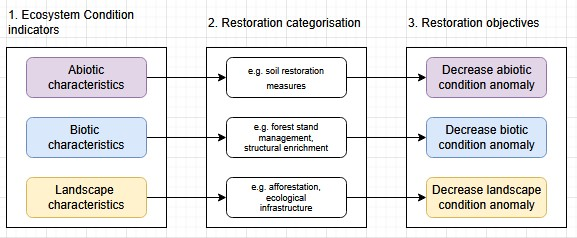
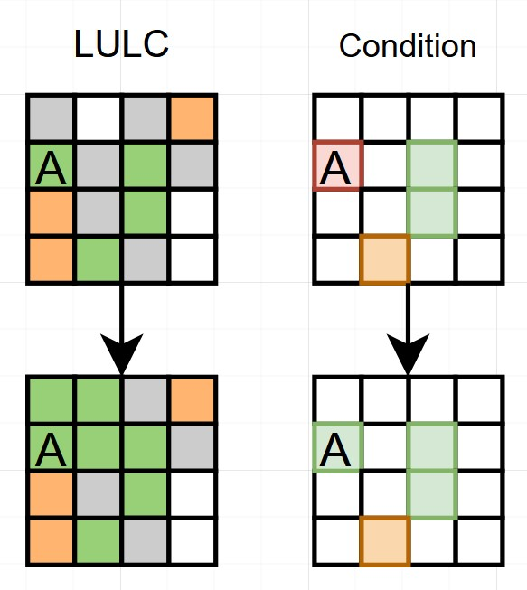

# Overview

Grouping of ecosystem condition indicators reflecting potential restoration interventions and objectives

{#fig-graphab width="80%"}

```{r}
#| label: set up
source("setup.R")
library(gridExtra)
  # Required libraries
  library(ggplot2)
  library(terra)
  library(sf)
  library(viridis)
  library(patchwork)
  library(ggpubr)
  library(grid)
  library(tidyr)  # For combining plots
  library(scales)
  library(readxl)
  library(purrr)
  library(emmeans)
ec_data <- load_ec_data()

ecosystem_types <- c("forest","agricultural","grassland")

```

```{r}

# Set ecosystem to forest and get relevant variables
ecosystem_forest <- "forest"
vars_forest <- ec_categories[["EC variables"]][[ecosystem_forest]]
codes_forest <- names(vars_forest)
rasters_forest <- ec_data[codes_forest]
rasters_forest <- rasters_forest[!sapply(rasters_forest, is.null)]
r_forest <- rast(rasters_forest)
r_masked_forest <- mask_by_ecosystem(r_forest, ecosystem_forest)

```

```{r}
#| label: ag vars
ecosystem_ag <- "agricultural"
vars_ag <- ec_categories[["EC variables"]][[ecosystem_ag]]
codes_ag <- names(vars_ag)
rasters_ag <- ec_data[codes_ag]
rasters_ag <- rasters_ag[!sapply(rasters_ag, is.null)]
r_ag <- rast(rasters_ag)
r_masked_ag <- mask_by_ecosystem(r_ag, ecosystem_ag)

```

```{r}
#| label: grass vars
ecosystem_grass <- "grassland"
vars_grass <- ec_categories[["EC variables"]][[ecosystem_grass]]
codes_grass <- names(vars_grass)
rasters_grass <- ec_data[codes_grass]
rasters_grass <- rasters_grass[!sapply(rasters_grass, is.null)]
r_grass <- rast(rasters_grass)
r_masked_grass <- mask_by_ecosystem(r_grass, ecosystem_grass)

```

```{r}
#| label: plot EC index

for_EC <- r_masked_forest[["forest_index"]]
ag_EC <- r_masked_ag[["agricultural_index"]]
grass_EC <- r_masked_grass[["grass_index"]]
for_EC_df <- as.data.frame(for_EC, xy=TRUE)
ag_EC_df <- as.data.frame(ag_EC, xy=TRUE)
grass_EC_df <- as.data.frame(grass_EC, xy=TRUE)

all_df <- bind_rows(for_EC_df, ag_EC_df)
all_df <- bind_rows(all_df, grass_EC_df)
names(all_df)[3:5]<- c("Forest", "Agricultural", "Grassland")
all_df <- all_df %>% mutate(out = coalesce(Forest, Agricultural, Grassland))
#plot the three EC indices and a side plot with the values per ecosystem


lng_df <- all_df %>% pivot_longer(cols=Forest:Grassland, names_to="ecosystem", values_to="Val")

```

```{r}
#Classified version
library(classInt)

vals <- values(for_EC, na.rm = TRUE)
nb <- classInt::classIntervals(vals, n = 5, style = "fisher")$brks
mat <- cbind(nb[-length(nb)], nb[-1], 1:(length(nb) - 1))
fc <- classify(for_EC, mat)
vals <- values(ag_EC, na.rm = TRUE)
nb <- classInt::classIntervals(vals, n = 5, style = "fisher")$brks
mat <- cbind(nb[-length(nb)], nb[-1], 1:(length(nb) - 1))
ac <- classify(ag_EC, mat)
vals <- values(grass_EC, na.rm = TRUE)
nb <- classInt::classIntervals(vals, n = 5, style = "fisher")$brks
mat <- cbind(nb[-length(nb)], nb[-1], 1:(length(nb) - 1))
gc <- classify(grass_EC, mat)

for_EC_df <- as.data.frame(fc, xy=TRUE)
ag_EC_df <- as.data.frame(ac, xy=TRUE)
grass_EC_df <- as.data.frame(gc, xy=TRUE)

break_df <- bind_rows(for_EC_df, ag_EC_df)
break_df <- bind_rows(break_df, grass_EC_df)
names(break_df)[3:5]<- c("Forest", "Agricultural", "Grassland")
break_df <- break_df %>% mutate(out = coalesce(Forest, Agricultural, Grassland))
combined_ec_df <- break_df %>% select(x,y,out)
combined_ec <- rast(combined_ec_df, type="xyz")
```

```{r}
#| label: setup anomalies
# Calculate anomalies by ecosystem type and combine into single raster

# Function to calculate anomalies for an ecosystem
calculate_ecosystem_anomalies <- function(ecosystem_name) {
  # Get variables for this ecosystem
  vars_eco <- ec_categories[["EC variables"]][[ecosystem_name]]
  codes_eco <- names(vars_eco)
  rasters_eco <- ec_data[codes_eco]
  rasters_eco <- rasters_eco[!sapply(rasters_eco, is.null)]
  r_eco <- rast(rasters_eco)
  r_masked_eco <- mask_by_ecosystem(r_eco, ecosystem_name)
  
  # Calculate anomalies for each variable
  anom_stack_eco <- rast()
  for (var in codes_eco) {
    if(var %in% names(r_masked_eco)) {
      r_var <- r_masked_eco[[var]]
      m_var  <- global(r_var, "mean", na.rm = TRUE)[[1]]
      sd_var <- global(r_var, "sd", na.rm = TRUE)[[1]]
      
      if(!is.na(sd_var) && sd_var > 0) {
        anom_var <- (r_var - m_var) / sd_var
        names(anom_var) <- paste0(var, "_anom_", ecosystem_name)
        anom_stack_eco <- c(anom_stack_eco, anom_var)
      }
    }
  }
  return(anom_stack_eco)
}

# Calculate anomalies for each ecosystem type
ecosystems <- c("forest", "agricultural", "grassland")
all_anom_stacks <- list()

for(eco in ecosystems) {
  all_anom_stacks[[eco]] <- calculate_ecosystem_anomalies(eco)
}

# Combine all anomaly stacks
combined_anom_stack <- rast()
for(eco in ecosystems) {
  if(nlyr(all_anom_stacks[[eco]]) > 0) {
    combined_anom_stack <- c(combined_anom_stack, all_anom_stacks[[eco]])
  }
}

# Create master anomaly dataframe for visualization
anom_df <- as.data.frame(combined_anom_stack, xy = TRUE, na.rm = FALSE)
# Convert to long format and extract ecosystem information
anom_long <- anom_df %>%
  pivot_longer(cols = -c(x, y),
               names_to = "variable",
               values_to = "anomaly") %>%
  filter(!is.na(anomaly)) %>%
  mutate(
    ecosystem = case_when(
      grepl("_forest$", variable) ~ "Forest",
      grepl("_agricultural$", variable) ~ "Agricultural", 
      grepl("_grassland$", variable) ~ "Grassland",
      TRUE ~ "Unknown"
    ),
    var_clean = gsub("_anom_(forest|agricultural|grassland)$", "", variable),
    var_clean = gsub("_anom$", "", var_clean)
  )

theme_plots <- theme_bw()+
    theme(axis.text = element_blank(),
          axis.ticks = element_blank(),
          axis.title.x = element_blank(),
          axis.title.y = element_blank(),
          strip.text = element_text(size = 8))

library(RColorBrewer)

# Create combined anomaly plot showing all ecosystems together
combined_anom_plot <- ggplot(anom_long, aes(x = x, y = y, fill = anomaly)) +
    geom_raster() +
    facet_grid(var_clean ~ ecosystem) +
    scale_fill_viridis_c(option = "RdYlBu", direction = -1, name = "Z-score") +
    theme_plots +
    labs(title = "Anomalies by Variable and Ecosystem Type") +
    theme(plot.title = element_text(hjust = 0.5, face = "bold"))

#print(combined_anom_plot)
#anom_plots

```

```{r}
#| label: mean ECT anomalies
# derive and plot mean anomalies by ECT class

# Create ECT categories based on clean variable names
anom_long$ect <- ifelse(anom_long$var_clean %in% c("smd","sbd","soc"), "Abiotic",
                        ifelse(anom_long$var_clean %in% c("uzl","tsd","can", "cdi","swf_h", "swf_t","lai", "ndvi"), "Biotic","Landscape")) 

# Calculate mean anomalies by ECT class across ALL ecosystems
class_mean_anoms <- anom_long %>%
  group_by(ect, x, y) %>%
  summarise(mean_anom = mean(anomaly, na.rm = TRUE), .groups = 'drop')

mean_plt <- ggplot(class_mean_anoms, aes(x = x, y = y, fill = mean_anom))+
    geom_raster()+
    facet_wrap(~ect, ncol=3)+
    scale_fill_viridis_c(option = "viridis", name = "Mean anomaly")+
    theme_plots +
    labs(title = "Mean Anomalies by ECT Category") +
    theme(plot.title = element_text(hjust = 0.5, face = "bold"))

#print(mean_plt)

eco_mean_anoms <- anom_long %>%
  group_by(ect,ecosystem, x, y) %>%
  summarise(mean_anom = mean(anomaly, na.rm = TRUE), .groups = 'drop')

#test_plt <- ggplot(eco_mean_anoms, aes(x = x, y = y, fill = mean_anom))+
#    geom_raster()+
#    facet_wrap(~ect+ecosystem, ncol=3)+
#    scale_fill_viridis_c(option = "viridis", name = "Mean anomaly")+
#    theme_plots +
#    labs(title = "Mean Anomalies by ECT Category") +
#    theme(plot.title = element_text(hjust = 0.5, face = "bold"))

#print(test_plt)
```

```{r}
#| label: plot initial conditions
  
ggplot(eco_mean_anoms, aes(x = x, y = y, fill = meam_anom)) +
    geom_raster(interpolate = TRUE) +
    scale_fill_identity() +
    coord_fixed() +
    facet_wrap(~ect)
    theme_void()

```


```{r}
#| label: calculate noise
#r  <- rast("anom.tif")
#lv <- focal(r, w = 3, fun = var, na.rm = TRUE)
#global(lv, "mean", na.rm = TRUE)
```

```{r}
#| label: clusters based on mean anomalies

df_wide <- eco_mean_anoms %>%
  ungroup() %>%
  select(x, y, ect, ecosystem, mean_anom) %>%
  pivot_wider(names_from = ect, values_from = mean_anom) %>%
  rename(abiotic_mean = Abiotic, biotic_mean = Biotic, landscape_mean = Landscape) %>%
  filter(!is.na(abiotic_mean) & !is.na(biotic_mean) & !is.na(landscape_mean))

```

```{r}
#| label: bivariate set-up
labs <- c("1 - 1", "1 - 2", "1 - 3", "2 - 1", "2 - 2", "2 - 3", "3 - 1", "3 - 2", "3 - 3")

cols_ab <- c("#d3d3d3", "#88cfcf", "#00c5c5", "#c881bb", "#817eb6", "#0079ae", "#b70092", "#76008f", "#000089")
cols_bl <- c("#d3d3d3", "#e1e14d", "#e8e800", "#88cfcf", "#91dc4c", "#96e300", "#00c5c5", "#00d248", "#00d900")
cols_al <- c("#d3d3d3", "#e1e14d", "#e8e800", "#c881bb", "#d58a44", "#dc8e00", "#b70092", "#c30036", "#c90000")

legend_ab <- tibble(group = labs, fill = cols_ab)
legend_bl <- tibble(group = labs, fill = cols_bl)
legend_al <- tibble(group = labs, fill = cols_al)

classify3_sd <- function(x){
  cut(x,
      breaks = c(-Inf, -sd(x), sd(x), Inf),
      labels = c("3", "2", "1"))
}

df_class <- df_wide |>
  group_by(ecosystem) |>
  mutate(
    abiotic_class    = classify3_sd(abiotic_mean),
    biotic_class     = classify3_sd(biotic_mean),
    landscape_class  = classify3_sd(landscape_mean),
    ab = paste(abiotic_class, biotic_class, sep = " - "),
    bl = paste(biotic_class, landscape_class, sep = " - "),
    al = paste(abiotic_class, landscape_class, sep = " - "),
  )

df_ab <- left_join(df_class, legend_ab, by=c("ab"="group"))
df_bl <- left_join(df_class, legend_bl, by=c("bl"="group"))
df_al <- left_join(df_class, legend_al, by=c("al"="group"))

break_df <- break_df %>% select(-Forest, -Agricultural, -Grassland)

```

# Optimisation logic

1.  Improve abiotic condition: Maximise number of pixels with positive abiotic anomaly
2.  Improve biotic condition: Maximise number of pixels with positive biotic anomaly
3.  Improve landscape condition: Maximise number of pixels with positive landscape anomaly

whilst

4.  Minimising overall cost of strategy: Minimise total cost of selected pixels

## Sensitivity of priority area selection

One of the focuses of this exploratory modelling is to investigate the robustness of prioritisation according to various sources of uncertainty. These can be categorised following existing frameworks (below using Roman et al., 2026 as related to LULC modelling, but similar conceptually to Rounsevell et al., 2021)

| External uncertainties | Planning decisions | Inherent system stochasticity |
|------------------------|------------------------|------------------------|
| Magnitude of change of abiotic condition upon restoration\* | Maximum area to restore\* | Use of random generators in optimisation |
| Magnitude of change of biotic condition upon restoration\* | Degree of spatial clustering* |  |
| Heterogeneity of restoration effect | Size of planning unit |  |
|  | Burden sharing across administrative regions\* |  |
| Future conditions |  |  |

(*currently operationalised)

## Ecosystem Condition anomalies {.tabset}

-   Mean anomalies calculated per ECT category, per ecosystem type

```{r}

bi_raster_plot <- function(df, title) {
  ggplot(df, aes(x = x, y = y, fill = fill)) +
    geom_raster(interpolate = TRUE) +
    scale_fill_identity() +
    coord_fixed() +
    labs(title = title) +
    theme_void() +
    theme(legend.position = "none")
}

bi_legend_plot <- function(df, xvar, xlabel, yvar, ylabel) {
  df %>%
    separate(group, into = c(xvar, yvar), sep = " - ") %>%
    dplyr::mutate(
      dplyr::across(dplyr::all_of(c(xvar, yvar)), as.integer),
      fill = as.character(fill)) %>%
    ggplot(aes(x = .data[[xvar]], y = .data[[yvar]], fill = fill)) +
    geom_tile() +
    scale_fill_identity() +
    scale_x_discrete(breaks = 1:3, labels = c("-ve", "Mid", "+ve")) +
    scale_y_discrete(breaks = 1:3, labels = c("-ve", "Mid", "+ve")) +
    labs(x = xlabel, y = ylabel) +
    coord_fixed() +
    theme_void() +
    theme(
      axis.title = element_text(size = 7),
      axis.text = element_text(size = 7),
      axis.title.y = element_text(angle = 90)
    )
}

```

```{r}
#| label: ab filtered

df_ab_filt <- df_ab |>
  left_join(break_df, by = c("x", "y")) |>
  mutate(fill2 = ifelse(out >= 3, "grey70", fill))

p1_ab <- bi_raster_plot(df_ab_filt, "Abiotic-Biotic anomaly")
p2_ab <- bi_legend_plot(legend_ab, "Abiotic", "Abiotic →", "Biotic", "Biotic →")

inset_ab <- p1_ab +
  inset_element(  p2_ab,    left   = 0.68, bottom = 0.68,  right  = 0.99,  top    = 0.99,
    align_to = "panel")

```

```{r}
#| label: bl filtered

df_bl_filt <- df_bl |>
  left_join(break_df, by = c("x", "y")) |>
  mutate(fill2 = ifelse(out >= 3, "grey70", fill))

p1_bl <- bi_raster_plot(df_bl_filt, "Biotic-Landscape anomaly")
p2_bl <- bi_legend_plot(legend_bl, "Biotic", "Biotic →", "Landscape", "Landscape →")

inset_bl <- p1_bl +
  inset_element(p2_bl,   left   = 0.68, bottom = 0.68,  right  = 0.99,  top    = 0.99,
    align_to = "panel")

```

```{r}
#| label: al filtered
df_al_filt <- df_al |>
  left_join(break_df, by = c("x", "y")) |>
  mutate(fill2 = ifelse(out >= 3, "grey70", fill))

p1_al <- bi_raster_plot(df_al_filt, "Abiotic-Landscape anomaly")
p2_al <- bi_legend_plot(legend_al, "Abiotic", "Abiotic →", "Landscape", "Landscape →")

inset_al <- p1_al +
  inset_element( p2_al,    left   = 0.68, bottom = 0.68,  right  = 0.99,  top    = 0.99,
    align_to = "panel")

```

```{r}
#| label: plot_anoms
#| layout-ncol: 2

inset_ab
inset_bl
inset_al
```

Increasing colour strength indicates a stronger negative anomaly, closer to grey indicates stronger positive anomaly

```{r}

#| label: anomalies - not filtered
#| eval: false

# Not filtered

#-   All areas, including good condition areas
#-   Increasing colour strength indicating stronger negative anomaly

p1_ab <- bi_raster_plot(df_ab, "Abiotic-Landscape anomaly")
p2_ab <- bi_legend_plot(legend_ab, "Abiotic", "Abiotic →", "Landscape", "Landscape →")

inset_ab <- p1_ab +
  inset_element(p2_ab,    left   = 0.68, bottom = 0.68,  right  = 0.99,  top    = 0.99,
    align_to = "panel")

p1_al <- bi_raster_plot(df_al_filt, "Abiotic-Landscape anomaly")
p2_al <- bi_legend_plot(legend_al, "Abiotic", "Abiotic →", "Landscape", "Landscape →")

inset_al <- p1_al +
  inset_element( p2_al,    left   = 0.68, bottom = 0.68,  right  = 0.99,  top    = 0.99,
    align_to = "panel")

p1_bl <- bi_raster_plot(df_bl, "Abiotic-Landscape anomaly")
p2_bl <- bi_legend_plot(legend_bl, "Abiotic", "Abiotic →", "Landscape", "Landscape →")

inset_bl <- p1_bl +
  inset_element(p2_bl,   left   = 0.68, bottom = 0.68,  right  = 0.99,  top    = 0.99,
    align_to = "panel")

```

## Cost

Derived based on slope, distance to roads, land value and soil suitability

Produced a relative index --\> strategy should aim to reduce the average cost index of selected areas rather than the total cost of the strategy.

! Land value data available for Kanton Bern, but not at national scale; Value of FFF areas makes restoration really very unlikely according to practitioners.

```{r}
cost_dir <- "Y:/CH_Kanton_Bern/03_Workspaces/03_Habitat_condition/Restoration_potential/Implementation_cost_eva/Result/"
ccost <- rast(paste0(cost_dir, "cropland_cost_w.tif"))
gcost <- rast(paste0(cost_dir, "grassland_cost_w.tif"))
fcost <- rast(paste0(cost_dir, "forest_cost_w.tif"))

norm01 <- function(r) {
  mm <- global(r, c("min", "max"), na.rm = TRUE)
  rmin <- mm[1, "min"]
  rmax <- mm[1, "max"]
  (r - rmin) / (rmax - rmin)
}

ccost <- norm01(ccost)
gcost <- norm01(gcost)
fcost <- norm01(fcost)

cdf <- as.data.frame(ccost, xy=TRUE)
gdf <- as.data.frame(gcost, xy=TRUE)
fdf <- as.data.frame(fcost, xy=TRUE)

comb <- bind_rows(cdf, gdf, fdf)
cost <- rast(comb, type="xyz")
crs(cost)<-"epsg:2056"
#writeRaster(cost, "implementation_cost.tif", overwrite=TRUE)

#ref_path  <- "abiotic_condition_anomaly.tif"
#ref  <- rast("abiotic_condition_anomaly.tif")


#cost_aligned <- project(cost, ref, method = "bilinear")  # use "near" if you want nearest neighbour
#writeRaster(cost_aligned, "implementation_cost.tif", overwrite = TRUE)


#cost_df <- left_join(class_mean_anoms, comb, by=c("x"="x", "y"="y"))

cost_df <- as.data.frame(cost, xy=TRUE)

ggplot(comb, aes(x = x, y = y, fill = ifelse(Band_1 == 0, NA, Band_1))) +
  geom_raster() +
  scale_fill_viridis(option = "inferno", direction = -1, na.value = NA) +
  coord_fixed() +
  theme_minimal() +
  theme(legend.position = "none")

```

## Correlations

add a correlation matrix for the objectives
{.lightbox}

## Decision space

-   All pixels of selected ecosystem types are eligible for restoration
-   Constraints: exact pixel number enforced

binary random sampling, except if burden sharing or clustering selected

# Results

```{r}
file_ext <- params$file_ext

```

Results of optimal solutions for latest implementation

::::: {#fig-optresults layout-ncol="2"}
::: column
{.lightbox}

{.lightbox}
:::

::: column
{.lightbox}
:::
:::::

Restoration effect is not great - creates a random distribution 

{.lightbox}

# Sensitivity to scenario parameters

.. of objective values

```{r}
#| label: sensitivity of objective values
#| layout-ncol: 2
df <- read.csv("scenarios_1401_1.csv")
df_lng <- pivot_longer(df, cols = abiotic_anomaly:implementation_cost, names_to = "Objective", values_to = "Obval")
df_lng$burden_sharing <- ifelse(df_lng$burden_sharing == "no", 0, 1)

df0 <- df_lng %>% filter(Objective == "abiotic_anomaly")%>% select(-n_pixels_restored)%>%
                    pivot_longer(cols=max_restoration_fraction:landscape_effect,names_to = "Param", values_to = "Param_value")
df1 <- df_lng %>% filter(Objective == "biotic_anomaly")%>% select(-n_pixels_restored)%>%
                    pivot_longer(cols=max_restoration_fraction:landscape_effect,names_to = "Param", values_to = "Param_value")
df2 <- df_lng %>% filter(Objective == "landscape_anomaly")%>% select(-n_pixels_restored)%>%
                    pivot_longer(cols=max_restoration_fraction:landscape_effect,names_to = "Param", values_to = "Param_value")
df3 <- df_lng %>% filter(Objective == "implementation_cost")%>% select(-n_pixels_restored)%>%
                    pivot_longer(cols=max_restoration_fraction:landscape_effect,names_to = "Param", values_to = "Param_value")

df0$Param_value <- as.factor(df0$Param_value)
df1$Param_value <- as.factor(df1$Param_value)
df2$Param_value <- as.factor(df2$Param_value)
df3$Param_value <- as.factor(df3$Param_value)

ggplot(df0)+
    geom_boxplot(aes(x=factor(Param_value), y=Obval))+
    facet_wrap(~Param, scales="free")+
    labs(x="Parameter value", y="Objective value", title="abiotic anomaly")+
    theme_bw()

ggplot(df1)+
    geom_boxplot(aes(x=factor(Param_value), y=Obval))+
    facet_wrap(~Param, scales="free")+
    labs(x="Parameter value", y="Objective value", title="biotic anomaly")+
    theme_bw()

ggplot(df2)+
    geom_boxplot(aes(x=factor(Param_value), y=Obval))+
    facet_wrap(~Param, scales="free")+
    labs(x="Parameter value", y="Objective value", title="landscape anomaly")+
    theme_bw()

ggplot(df3)+
    geom_boxplot(aes(x=factor(Param_value), y=Obval))+
    facet_wrap(~Param, scales="free")+
    labs(x="Parameter value", y="Objective value", title="implementation cost")+
    theme_bw()

```

.. of spatial distribution

{.lightbox}

```{r}
#| label: parameter effects

df <- read.csv("scenarios_1401_1.csv")
df <- df %>%
  mutate(
    frac = factor(max_restoration_fraction),
    clust = factor(spatial_clustering),
    ab = factor(abiotic_effect),
    bio = factor(biotic_effect)
  )

## Option 1: one model per objective, planned contrasts per parameter

objective_cols <- c("abiotic_anomaly", "biotic_anomaly", "landscape_anomaly", "implementation_cost")  

fit_one_objective <- function(dat, ycol) {
  f <- as.formula(paste0(ycol, " ~ frac + clust + ab + bio"))
  m <- lm(f, data = dat)

  res <- list(
    model = m,
    frac = summary(contrast(emmeans(m, ~ frac), "pairwise", adjust = "BH")),
    clust = summary(contrast(emmeans(m, ~ clust), "pairwise", adjust = "BH")),
    ab = summary(contrast(emmeans(m, ~ ab), "pairwise", adjust = "BH")),
    bio = summary(contrast(emmeans(m, ~ bio), "pairwise", adjust = "BH"))
  )
  res
}

results_by_objective <- setNames(
  lapply(objective_cols, \(y) fit_one_objective(df, y)),
  objective_cols
)

# Example: view contrasts for p1 on obj1
#results_by_objective[["abiotic_anomaly"]]$frac

param_list <- c("frac", "clust", "ab", "bio")

effect_strength <- function(model, param) {
  emm <- emmeans(model, as.formula(paste0("~ ", param)))
  emm_df <- as.data.frame(emm)

  rng <- diff(range(emm_df$emmean, na.rm = TRUE))
  rsd <- sigma(model)

  tibble(
    parameter = param,
    effect_std = rng / rsd,
    effect_raw = rng
  )
}

heat_df <- imap_dfr(
  results_by_objective,
  \(res, obj) {
    map_dfr(param_list, \(p) effect_strength(res$model, p)) %>%
      mutate(objective = obj)
  }
)

# order objectives and parameters if you want
heat_df <- heat_df %>%
  mutate(
    objective = factor(objective, levels = unique(objective)),
    parameter = factor(parameter, levels = param_list)
  )


## Compute a distance to the Pareto front, then model that distance
## This code computes distance to the empirical nondominated set in your data.

# 2a. Helper: identify nondominated points
# Assumption: all objectives are to be minimised.
# If some objectives are to be maximised, see "directions" below.

is_nondominated <- function(X) {
  n <- nrow(X)
  nd <- rep(TRUE, n)
  for (i in seq_len(n)) {
    if (!nd[i]) next
    for (j in seq_len(n)) {
      if (i == j) next
      # j dominates i if j is no worse in all objectives and better in at least one
      if (all(X[j, ] <= X[i, ]) && any(X[j, ] < X[i, ])) {
        nd[i] <- FALSE
        break
      }
    }
  }
  nd
}

# 2b. Choose objectives and directions
objs <- c("abiotic_anomaly", "biotic_anomaly", "landscape_anomaly", "implementation_cost")  # edit
directions <- c("min", "min", "min", "min")  # one per objective, use "max" where needed

X <- as.matrix(df[, objs])

# Convert max objectives to min by multiplying by minus one
for (k in seq_along(objs)) {
  if (directions[k] == "max") X[, k] <- -X[, k]
}

# 2c. Normalise objectives so distances are comparable across scales
rng <- apply(X, 2, range, na.rm = TRUE)
Xn <- sweep(X, 2, rng[1, ], "-")
Xn <- sweep(Xn, 2, (rng[2, ] - rng[1, ]), "/")

# 2d. Pareto front as empirical nondominated set
nd_flag <- is_nondominated(Xn)
front <- Xn[nd_flag, , drop = FALSE]

# 2e. Distance to front: nearest point on the front (discrete approximation)
dist_to_front <- function(x, Fr) {
  d2 <- rowSums((Fr - matrix(x, nrow(Fr), ncol(Fr), byrow = TRUE))^2)
  sqrt(min(d2))
}
df$dist_pareto <- apply(Xn, 1, dist_to_front, Fr = front)

# 2f. Model distance, smaller is better
m_dist <- lm(dist_pareto ~ frac + clust + ab + bio, data = df)

# Planned contrasts
#c_p1_dist <- summary(contrast(emmeans(m_dist, ~ frac), "pairwise", adjust = "BH"))
#c_p2_dist <- summary(contrast(emmeans(m_dist, ~ clust), "pairwise", adjust = "BH"))
#c_p3_dist <- summary(contrast(emmeans(m_dist, ~ ab), "pairwise", adjust = "BH"))
#c_p4_dist <- summary(contrast(emmeans(m_dist, ~ bio), "pairwise", adjust = "BH"))

build_effect_rows <- function(model, objective_name) {
  map_dfr(param_list, \(p) effect_strength(model, p)) %>%
    mutate(objective = objective_name)
}
heat_dist <- build_effect_rows(m_dist, "dist_pareto")

heat_df <- bind_rows(heat_df, heat_dist) 

#heat_df <- heat_df %>%
#  mutate(recode(parameter, frac="Max restoration fraction", clust="Spatial clustering", ab="Abiotic improvement", bio="Biotic improvement"))%>%
#  mutate(recode(objective, abiotic_anomaly="Overall abiotic benefit", biotic_anomaly="Overall biotic benefit",
#  landscape_anomaly="Overall landscape benefit", implementation_cost="Mean cost", dist_pareto="Distance to PF"))
heat_df <- heat_df %>%
  mutate(
    parameter = factor(parameter, levels = param_list),
    objective = factor(objective, levels = c(objs, "dist_pareto")))

ggplot(heat_df, aes(x = parameter, y = objective, fill = effect_std)) +
  geom_tile() +
  labs(
    x = "Parameter",
    y = "Affected variable",
    fill = "Effect strength",
    title = "Parameter effect strength across objectives and Pareto distance"
  )

```

```{r}
df <- read.csv(paste0("results_",file_ext,"_selection_corr.csv"))

ab_corr <- df %>% filter(objective=="abiotic_anomaly")
bio_corr <- df %>% filter(objective=="biotic_anomaly")
ls_corr <- df %>% filter(objective=="landscape_anomaly")
cost_corr <- df %>% filter(objective=="implementation_cost")
ab_c_mean <- mean(ab_corr$corr_baseline_vs_sel_freq)
bio_c_mean <- mean(bio_corr$corr_baseline_vs_sel_freq)
ls_c_mean <- mean(ls_corr$corr_baseline_vs_sel_freq)
cost_c_mean <- mean(cost_corr$corr_baseline_vs_sel_freq)
```

Correlation beween initial conditions and probability pixel will be selected:

-   Abiotic anomaly : `r {round(ab_c_mean, 2)}`
-   Biotic anomaly : `r {round(bio_c_mean, 2)}`
-   Landscape anomaly : `r {round(ls_c_mean, 2)}`
-   Cost : `r {round(cost_c_mean, 2)}`


# Discussion points

1. Biodiversity data availability

2. Objectives don't show much variation across scenarios:

At least in part due to current implementation of abiotic/biotic improvement: A solution is only better if it pushes a pixel above the 0 threshold. Small improvements that do not cross 0 are not ignored. No heterogeneity is included in the spatial distribution of improvement effect (equal effort assumed to have equal response).

3. How to implement difference in effect for landscape restoration?

Landscape issue: 

A/biotic condition of a pixel is determined by the value of indicators at the pixel location
Landscape condition of a pixel is determined by the presence of certain LULC types in the surrounding pixels

= restoration of a/biotic condition can have an effect on the selected pixel

= restoration of landscape condition relies on change in LULC in surrounding pixels

--> how to define a decision variable that can do both?

--> how to include different costs (i.e. include opportunity costs)?

{.lightbox}


# Next steps

-   Extend to Switzerland (re-process some indicators, stratify anomalies)
-   Look at Geoembeddings dataset/methodology for trends
-   Process available time series data (obtain and align datasets, calculate temporal anomalies)
-   *Extend costs to Switzerland (Eva blocked on cost datasets)*
-   *Develop optimisation decision logic and run test*